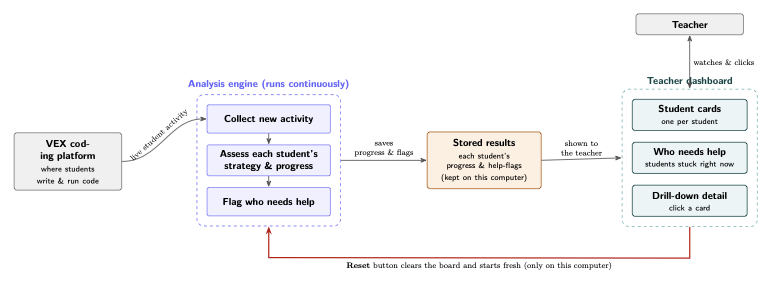

# LUC Cohort Dashboard

A live **"who needs help"** dashboard for a cohort of students coding in the VEX
block environment. It mirrors student activity from the Reflecks production
backend onto a local machine, infers each student's coding **strategy** with an
HMM, segments their session into **episodes**, raises **intervention flags**
(wheel-spinning, idle, big rewrite), and shows it all on a researcher dashboard.



> A more technical version of this diagram is in [`docs/architecture.pdf`](docs/architecture.pdf),
> and the full system design is in [`docs/DESIGN.md`](docs/DESIGN.md).

---

## How it works (in one paragraph)

Students code in VEX; their logs land in the **Reflecks production server**. A
local **daemon** polls that server's REST API for new events (cursor-based, with
idle backoff), stores the raw logs in a local SQLite file, and continuously
computes each tracked student's derived state (strategy / episodes / flags) into
a **materialized table**. A small **read API** serves that table to a **React
dashboard**. The daemon is the *only writer*; the dashboard never recomputes
anything — it just reads precomputed state. Nothing is ever written back to
production (it's a read-only mirror).

## Project layout

```
app/
  main.py              FastAPI read API (CORS, ensures schema on load)
  db.py                raw-sqlite3 data layer — schema, queries, JSON/datetime handling
  config.py            env-derived settings (DB path, CORS, prod creds)
  smart_delta_engine.py  block-diff → LLM "playground" prompt
  strategy_hmm/        events → change scores → HMM latent states (+ trained model.pkl)
  pipeline/            the ingestion + inference daemon (the only DB writer)
    client.py          authenticated REST client for the prod server
    poller.py          cursor-based, idempotent ingest of raw logs
    workers.py         per-student in-memory workers → materialize student_state
    triggers.py        threshold rules → trigger_event
    daemon.py          the tick loop  (python -m app.pipeline)
frontend/              Vite + React single-screen dashboard
scripts/migrate_db.py  one-shot migration for an existing Reflecks SQLite DB
docs/                  architecture diagrams + DESIGN.md
```

**Two processes, one SQLite file (WAL):** the daemon writes derived state; the API
only reads it (plus tiny writes for the tracked allowlist, acks, and reset). The
API has **no ML dependencies** — all the heavy compute lives in the daemon.

---

## Setup

Requires Python 3.12+ and Node 18+.

```bash
python -m venv .venv && source .venv/bin/activate
pip install -r requirements.txt

cp .env.example .env.mirror      # then fill in PROD_USERNAME / PROD_PASSWORD
```

`.env.mirror` is only needed by the **daemon** (to authenticate to the prod
server). The API and dashboard don't need it. The SQLite database is created
automatically on first run — there's nothing to migrate on a fresh clone.

## Run

Three processes (each in its own terminal):

```bash
# 1. read API  → http://localhost:8000
uvicorn app.main:app --port 8000 --reload

# 2. ingestion + inference daemon (run EXACTLY ONE instance)
python -m app.pipeline

# 3. dashboard → http://localhost:3000
cd frontend && npm install && npm run dev
```

Open **http://localhost:3000**, type a student ID into "Track a student", and the
daemon backfills their recent history, materializes their state, and their card
appears. The dashboard is read-only against your local mirror.

## Using the dashboard

- **Student cards** — one box per tracked student, in a stable order (a card never
  jumps when its own data updates). Each shows the current **strategy state**
  (Iterator / Explorer / Stuck), a **strategy (HMM) sparkline**, an **episode
  sparkline**, and run/event counts.
- **"Who needs help" column** (right) — students currently **wheel-spinning**
  (HMM "stuck" state). This is the live intervention list.
- **Drill-down** — click any card for the full detail: the "playground" prompt
  (their current code described for an LLM), and full-size episode + strategy
  timelines.
- **Reset** (↺, top bar) — clears all locally-stored progress and flags and tells
  the daemon to drop its in-memory state, so the board starts fresh and rebuilds
  from new activity. **Local only — production is never touched.**

---

## Configuration

All settings are environment variables (put daemon creds in `.env.mirror`):

| Variable | Used by | Default | Purpose |
|---|---|---|---|
| `PROD_USERNAME` / `PROD_PASSWORD` | daemon | — | auth to the prod server |
| `VEX_PROD_API_BASE` | daemon | `https://inviteinstitutehub.org` | prod server base URL |
| `DB_PATH` | both | `db.sqlite3` | SQLite file location |
| `CORS_ORIGINS` | API | `http://localhost:3000,http://localhost:5173` | allowed dashboard origins |
| `PIPELINE_INTERVAL` | daemon | `0.5` | base seconds/tick while events flow |
| `PIPELINE_IDLE_MAX` | daemon | `5.0` | idle-backoff ceiling (poll gap when quiet) |
| `PIPELINE_PAGE_LIMIT` | daemon | `500` | events fetched per page |
| `PIPELINE_BACKFILL_HOURS` | daemon | `0` | on first run, bound the initial drain (0 = all history) |

The same daemon settings are also CLI flags: `python -m app.pipeline --interval 1
--idle-max 8 --backfill-hours 2`.

**Polling & idle backoff:** while students are active the daemon polls every
`PIPELINE_INTERVAL`s; when nothing is happening it backs off exponentially toward
`PIPELINE_IDLE_MAX` (e.g. 0.5 → 1 → 2 → 4 → 5s) so it doesn't hammer prod with
empty requests, and snaps back to fast the moment activity resumes. Poll load is
a function of event volume, **not** the number of tracked students.

## API reference

| Method | Path | Purpose |
|--------|------|---------|
| `GET`  | `/` | health check |
| `GET`  | `/api/student_states/` | materialized per-student state (the dashboard's main read); `?students=a,b` or `?classCode=X` to filter |
| `GET`  | `/api/tracked/` | the tracked-student roster |
| `POST` | `/api/tracked/` | track `{studentID}` / untrack `{studentID, remove:true}` |
| `GET`  | `/api/triggers/` | active + recently-resolved intervention feed (all three trigger types) |
| `POST` | `/api/triggers/ack/` | dismiss a trigger (`{studentID}` or `{id}`) |
| `POST` | `/api/reset/` | clear all local progress/flags + signal the daemon |

> The three intervention triggers the engine computes are **wheel-spinning** (HMM
> stuck state), **inactivity** (≥ 5 min idle), and **big rewrite** (change-score ≥
> 0.5). The current dashboard surfaces wheel-spinning; all three are stored and
> available via `/api/triggers/`.

## Operational notes

- **Single writer:** run exactly one daemon instance — the cursor + idempotency
  assume a sole writer. The API can have multiple read workers.
- **Crash-safe:** a persisted cursor + unique event IDs make a restart lossless —
  the daemon re-drains a small overlap window and de-dupes. In-memory worker state
  is rebuilt from the raw logs on restart.
- **Fully rebuildable:** the derived tables are a cache of the raw logs. Delete
  them (or hit Reset) and they replay.

## Migrating an existing Reflecks database (optional)

Only if you're bringing over an old `reflecks` SQLite file (not needed for a fresh
clone). This renames the legacy `rabbitmq_*` tables to the clean names and reclaims
space:

```bash
cp db.sqlite3 db.backup.sqlite3      # back up first
python scripts/migrate_db.py
```

## Scaling & limitations

Comfortable for a classroom (tens of students) on one machine. The first thing to
strain at much larger scale is the single daemon's sequential per-student
inference (not memory). When you outgrow polling, the next step is **push-based
ingestion** (prod publishes events) rather than adding local infrastructure. See
[`docs/DESIGN.md`](docs/DESIGN.md) for the full design, trade-offs, and evolution
path.
