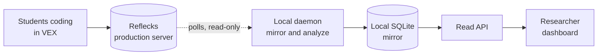

# LM Dashboard

A live "who needs help" dashboard for a room of students coding in the VEX block
environment. It mirrors what they're doing from the Reflecks production backend
onto your machine, works out each student's coding strategy with an HMM, breaks
their session into episodes, raises intervention flags when someone's
wheel-spinning, idle, or rewriting everything, and puts it all on one screen.



> The full system design, including the write/read (CQRS) split, is in
> [`docs/DESIGN.md`](docs/DESIGN.md). The browsable docs site lives in `docs/`; run
> `mkdocs serve` and open http://localhost:4000.

---

## How it works (in one paragraph)

Students code in VEX, and their logs land in the Reflecks production server. A local
daemon polls that server's REST API for new events (it keeps a cursor and backs off
when things are quiet), stores the raw logs in a local SQLite file, and keeps each
tracked student's derived state (strategy, episodes, flags) up to date in a
materialized table. A small read API hands that table to a React dashboard. The
daemon is the only thing that writes; the dashboard never recomputes anything, it
just reads what's already there. And nothing ever goes back to production. It's a
read-only mirror.

## Project layout

```
app/
  main.py              FastAPI read API (CORS, ensures schema on load)
  db.py                raw-sqlite3 data layer: schema, queries, JSON/datetime handling
  config.py            env-derived settings (DB path, CORS, prod creds)
  smart_delta_engine.py  block-diff to LLM "playground" prompt
  strategy_hmm/        events to change scores to HMM latent states (+ trained model.pkl)
  episode_engine/      session to CODE/RUN/RESET episodes + pauses (vendored, stdlib-only)
  pipeline/            the ingestion + inference daemon (the only DB writer)
    client.py          authenticated REST client for the prod server
    poller.py          cursor-based, idempotent ingest of raw logs
    workers.py         per-student in-memory workers that materialize student_state
    triggers.py        threshold rules that write trigger_event
    daemon.py          the tick loop (python -m app.pipeline)
frontend/              Vite + React single-screen dashboard
scripts/migrate_db.py  one-shot migration for an existing Reflecks SQLite DB
docs/                  MkDocs documentation site + DESIGN.md
```

Two processes, one SQLite file (WAL): the daemon writes derived state, and the API
only reads it (plus tiny writes for the tracked allowlist, acks, reset, and the
polling toggle). The API has no ML dependencies; all the heavy compute lives in the
daemon.

---

## Setup

You'll need Python 3.12+ and Node 18+.

```bash
python -m venv .venv && source .venv/bin/activate
pip install -r requirements.txt

cp .env.example .env.mirror      # then fill in PROD_USERNAME / PROD_PASSWORD
```

Only the daemon needs `.env.mirror` (to authenticate to the prod server). The API
and dashboard don't. The SQLite database creates itself on first run, so there's
nothing to migrate on a fresh clone.

## Run

Three processes, one terminal each:

```bash
# 1. read API  -> http://localhost:8000
uvicorn app.main:app --port 8000 --reload

# 2. ingestion + inference daemon (run EXACTLY ONE instance)
python -m app.pipeline

# 3. dashboard -> http://localhost:3000
cd frontend && npm install && npm run dev
```

Open http://localhost:3000, type a student ID into "Track a student", and the
daemon backfills their recent history, materializes their state, and their card
shows up. The dashboard is read-only against your local mirror.

## Using the dashboard

- **Student cards.** One box per tracked student, in a stable order so a card never
  jumps when its own data updates. Each shows the current strategy state (Iterator,
  Explorer, or Stuck), a strategy (HMM) sparkline, an episode sparkline, and
  run/event counts.
- **"Who needs help" column** (right). The live intervention feed: students
  currently wheel-spinning, idle, or doing a big rewrite, color-coded and ackable.
- **Drill-down.** Click any card for the full detail: the "playground" prompt (their
  current code described for an LLM) and full-size episode and strategy timelines.
- **Pause / resume polling** (top bar). Stops the daemon from hitting prod entirely
  so you can give production a break between sessions. It keeps running locally and
  resumes within about a second.
- **Export** (top bar). Writes a read-only CSV snapshot of every table to
  `exports/`. Safe to run any time.
- **Reset** (top bar). Clears all locally-stored progress and flags and tells the
  daemon to drop its in-memory state, so the board starts fresh. Local only;
  production is never touched. There's no automatic backup, so Export first if you
  want a copy.

---

## Configuration

Everything is set through environment variables (put daemon creds in `.env.mirror`):

| Variable | Used by | Default | Purpose |
|---|---|---|---|
| `PROD_USERNAME` / `PROD_PASSWORD` | daemon | (none) | auth to the prod server |
| `VEX_PROD_API_BASE` | daemon | `https://inviteinstitutehub.org` | prod server base URL |
| `DB_PATH` | both | `db.sqlite3` | SQLite file location |
| `CORS_ORIGINS` | API | `http://localhost:3000,http://localhost:5173` | allowed dashboard origins |
| `PIPELINE_INTERVAL` | daemon | `0.5` | base seconds/tick while events flow |
| `PIPELINE_IDLE_MAX` | daemon | `5.0` | idle-backoff ceiling (poll gap when quiet) |
| `PIPELINE_PAGE_LIMIT` | daemon | `500` | events fetched per page |
| `PIPELINE_BACKFILL_HOURS` | daemon | `24` | on first run, how far back the initial drain goes (`<= 0` = all history) |

The daemon settings are also CLI flags: `python -m app.pipeline --interval 1
--idle-max 8 --backfill-hours 2`.

**Polling and idle backoff:** while students are active the daemon polls every
`PIPELINE_INTERVAL`s; when nothing's happening it backs off exponentially toward
`PIPELINE_IDLE_MAX` (so 0.5 -> 1 -> 2 -> 4 -> 5s) instead of hammering prod with
empty requests, and snaps back to fast the moment activity returns. Poll load
tracks event volume, not the number of tracked students.

## API reference

| Method | Path | Purpose |
|--------|------|---------|
| `GET`  | `/` | health check |
| `GET`  | `/api/student_states/` | materialized per-student state (the dashboard's main read); `?students=a,b` or `?classCode=X` to filter |
| `GET`  | `/api/tracked/` | the tracked-student roster |
| `POST` | `/api/tracked/` | track `{studentID}` / untrack `{studentID, remove:true}` |
| `GET`  | `/api/triggers/` | active + recently-resolved intervention feed (all three trigger types) |
| `POST` | `/api/triggers/ack/` | dismiss a trigger (`{studentID}` or `{id}`) |
| `POST` | `/api/export/` | write a read-only CSV snapshot of all data |
| `POST` | `/api/reset/` | clear all local progress/flags + signal the daemon |
| `GET`  | `/api/polling/` | whether the daemon is currently polling prod |
| `POST` | `/api/polling/` | pause or resume the daemon's prod polling |

> The three intervention triggers are wheel-spinning (HMM stuck state), inactivity
> (5 min or more idle), and big rewrite (change-score 0.5 or higher). All three are
> stored and served via `/api/triggers/`.

## Operational notes

- **Single writer.** Run exactly one daemon. The cursor and idempotency assume a
  sole writer. The API can have as many read workers as you want.
- **Crash-safe.** A persisted cursor plus unique event IDs make a restart lossless.
  The daemon re-drains a small overlap window and de-dupes, and in-memory worker
  state rebuilds from the raw logs.
- **Fully rebuildable.** The derived tables are a cache of the raw logs. Delete them
  (or hit Reset) and they replay.

## Migrating an existing Reflecks database (optional)

Only if you're bringing over an old `reflecks` SQLite file (not needed for a fresh
clone). This renames the legacy `rabbitmq_*` tables to the clean names and reclaims
the space they were using:

```bash
cp db.sqlite3 db.backup.sqlite3      # back up first
python scripts/migrate_db.py
```

## Scaling and limitations

Comfortable for a classroom (tens of students) on one machine. The first thing that
strains at much larger scale is the daemon's sequential per-student inference (not
memory). When you outgrow polling, the next step is push-based ingestion (prod
publishes events) rather than adding local infrastructure. See
[`docs/DESIGN.md`](docs/DESIGN.md) for the full design and the evolution path.
