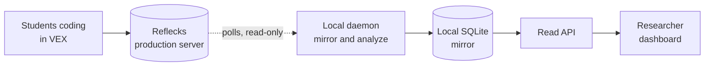

# Learner Modeling Dashboard

A live "who needs help" board for a room of students coding in VEX. It mirrors their
activity from the Reflecks production backend onto your own machine, infers each
student's coding strategy with an HMM, breaks the session into episodes, and surfaces
who needs attention right now (wheel-spinning, idle, big rewrite) on a single screen.
It only ever reads from production.



> The full documentation is published at <https://inviteinstitute.github.io/lm-dashboard/>
> (or run `mkdocs serve` to read it locally on port 4000).

## Quick Start

You'll need Python 3.12+ and Node 18+.

```bash
python -m venv .venv && source .venv/bin/activate
pip install -r requirements.txt
cp .env.example .env.mirror                         # then add PROD_USERNAME / PROD_PASSWORD
./scripts/stop.sh && ./scripts/start.sh --prod      # API :8000, daemon (paused), dashboard :3000, docs :4000
```

Open http://localhost:3000, add a student ID, and click **Resume polling** to start
pulling live data. Shut everything back down with `./scripts/stop.sh`.

## What You Get

- A card per student with their strategy state (Iterator / Explorer / Stuck),
  strategy and episode sparklines, and **Present** / **Picked** toggles.
- A live **"who needs help"** column where you can jot **notes** against each alert;
  click any learner for the full detail and their complete notes log.
- A top bar to pause and resume polling, **export** a CSV snapshot (one file per table
  in `exports/`), and reset the board.

## Under the Hood

The daemon is the only process that writes; the API and dashboard just read a SQLite
cache that can be rebuilt from the raw event log at any time. The full write-up,
covering configuration, the API, and the architecture, lives at
<https://inviteinstitute.github.io/lm-dashboard/>.
