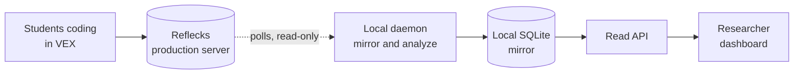

# LM Dashboard

A live "who needs help" view for a room of students coding in VEX. It mirrors their
activity from the Reflecks production backend, infers each student's strategy with
an HMM, segments the session into episodes, and flags who needs attention
(wheel-spinning, idle, big rewrite) on one screen. Read-only against production.



> Full docs are published at <https://inviteinstitute.github.io/lm-dashboard/>
> (or run `mkdocs serve` for them locally).

## Quick Start

Python 3.12+ and Node 18+.

```bash
python -m venv .venv && source .venv/bin/activate
pip install -r requirements.txt
cp .env.example .env.mirror     # add PROD_USERNAME / PROD_PASSWORD
./scripts/start.sh              # API :8000, daemon (paused), dashboard :3000, docs :4000
```

Open http://localhost:3000, add a student ID, then click **Resume polling** for live
data. Stop everything with `./scripts/stop.sh`.

## What You Get

- A card per student: strategy state (Iterator / Explorer / Stuck), strategy and
  episode sparklines, and **Present** / **Picked** toggles.
- A live **"who needs help"** column with **notes** you can jot per alert; click a
  learner for full detail and their complete notes log.
- Top bar: pause/resume polling, CSV **export** (one file per table in `exports/`),
  and reset.

## Under the Hood

The daemon is the only writer; the API and dashboard only read a rebuildable SQLite
cache. Full documentation, configuration, API, and architecture, is published at
<https://inviteinstitute.github.io/lm-dashboard/>.
