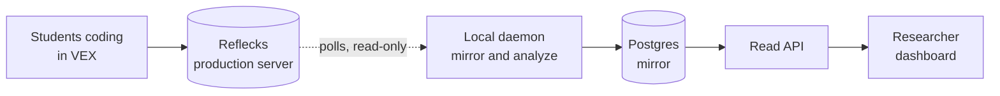

# Learner Modeling Dashboard

A live "who needs help" board for a room of students coding in VEX. It mirrors their
activity from the Reflecks production backend onto your own machine, measures how much
each student's code changes between runs (a plain edit distance, no black-box model),
breaks the session into episodes, and surfaces who needs attention right now
(wheel-spinning, resilience, inactive, explorer, step-by-step) on a single screen. It
only ever reads from production.


```mermaid
flowchart LR
    students["Students coding<br/>in VEX"] --> prod[("Reflecks<br/>production server")]
    prod -. "polls, read-only" .-> daemon["Local daemon<br/>mirror and analyze"]
    daemon --> pg[("Postgres<br/>mirror")]
    pg --> api["Read API"]
    api --> dash["Researcher<br/>dashboard"]
```

> The full documentation is published at <https://inviteinstitute.github.io/lm-dashboard/>
> (or run `mkdocs serve` to read it locally on port 4000).

## Quick Start

All you need is **Docker** (Desktop on Mac/Windows, or Docker + the compose plugin
on Linux). The whole stack — Postgres, the API (which serves the built dashboard),
and the ingestion daemon — runs from one compose file, the same on your laptop and
in prod.

```bash
# 1. app secrets
cp .env.example .env.mirror        # fill in SESSION_SECRET + PROD_USERNAME / PROD_PASSWORD

# 2. database password for compose
echo "POSTGRES_PASSWORD=$(python3 -c 'import secrets;print(secrets.token_hex(16))')" > .env

# 3. bring it all up
docker compose up -d               # dev: Vite hot-reload on :3000, API on :8000
```

- **Dev** (`docker compose up`) auto-loads `compose.override.yml`: the frontend runs
  under Vite with hot-reload on **http://localhost:3000** (it proxies `/api` to the
  API), and the API/daemon reload on code changes.
- **Prod** (`docker compose -f compose.yml up -d`) skips the override: the API serves
  the pre-built SPA on **:8000** (put a tunnel/reverse-proxy in front of it).

The schema is created automatically on API startup (`db.init_db()`), so there's no
separate migration step. Sign in with `PROD_USERNAME` / `PROD_PASSWORD` (the interim
shared login), or create real accounts with `scripts/create_researcher.py`. Tear it
down with `docker compose down`.

> Each browser gets its own isolated board (per-device isolation) even under a
> shared login. Prefer stable per-person boards? Make individual accounts with
> `scripts/create_researcher.py`.

Open the dashboard, add a student ID, and its data begins flowing while the board is
open.

## What You Get

- A card per student with a **run track** (one tile per run, coloured by how many
  blocks changed since the last run), an **episode** sparkline, a status badge derived
  from their active triggers, and **Present** / **Picked** toggles.
- A live **"who needs help"** column driven by five edit-distance triggers
  (wheel-spinning, resilience, inactive, explorer, step-by-step) where you can jot
  **notes** against each alert; click any learner for the full detail and notes log.
- A top bar to pause and resume polling, **export** all data as a downloadable zip of
  CSV snapshots, and reset the board.

## Serving It Remotely

Run the prod stack (`docker compose -f compose.yml up -d`) and put a tunnel or reverse
proxy in front of the API on :8000. Every `/api` route requires a researcher **login**
(a signed session cookie), so the data is never exposed ungated; the static dashboard
loads openly and shows the login screen. While served, a dead-man's switch pauses a
board's production polling whenever its dashboard isn't open.

## Under the Hood

The daemon is the only process that writes; the API and dashboard just read a Postgres
store that can be rebuilt from the raw event log at any time. The full write-up,
covering configuration, the API, and the architecture, lives at
<https://inviteinstitute.github.io/lm-dashboard/>.
