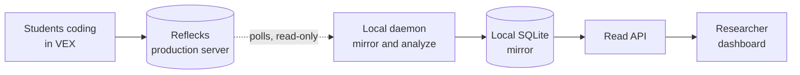

# Learner Modeling Dashboard

A live "who needs help" board for a room of students coding in VEX. It mirrors their
activity from the Reflecks production backend onto your own machine, measures how much
each student's code changes between runs (a plain edit distance, no black-box model),
breaks the session into episodes, and surfaces who needs attention right now
(wheel-spinning, resilience, inactive, explorer, step-by-step) on a single screen. It
only ever reads from production.


```mermaid
flowchart LR
    students["Students coding<br/>in VEX"] --> prod[("Reflecks<br/>production server")]
    prod -. "polls, read-only" .-> daemon["Local daemon<br/>mirror and analyze"]
    daemon --> sqlite[("Local SQLite<br/>mirror")]
    sqlite --> api["Read API"]
    api --> dash["Researcher<br/>dashboard"]
```

> The full documentation is published at <https://inviteinstitute.github.io/lm-dashboard/>
> (or run `mkdocs serve` to read it locally on port 4000).

## Quick Start

You'll need Python 3.12+, Node 18+, and Docker (Postgres runs in a container).

```bash
python -m venv .venv && source .venv/bin/activate
pip install -r requirements.txt
cp .env.example .env.mirror                         # set DATABASE_URL's password + PROD_USERNAME / PROD_PASSWORD

# One-time: start Postgres (latest) in a container backing DATABASE_URL.
docker run -d --name lmdash-pg --restart unless-stopped \
  -e POSTGRES_USER=lmdash -e POSTGRES_PASSWORD=<same as DATABASE_URL> -e POSTGRES_DB=lm_dashboard \
  -p 127.0.0.1:5432:5432 -v lmdash_pgdata:/var/lib/postgresql postgres:latest

./scripts/stop.sh && ./scripts/start.sh --prod      # API :8000, daemon (paused), dashboard :3000, docs :4000
```

The schema is created automatically on startup (`db.init_db()`); there is no
separate migration step. `scripts/start.sh` starts the `lmdash-pg` container if
it's stopped.

Open http://localhost:3000, add a student ID, and click **Resume polling** to start
pulling live data. Shut everything back down with `./scripts/stop.sh`.

## What You Get

- A card per student with a **run track** (one tile per run, coloured by how many
  blocks changed since the last run), an **episode** sparkline, a status badge derived
  from their active triggers, and **Present** / **Picked** toggles.
- A live **"who needs help"** column driven by five edit-distance triggers
  (wheel-spinning, resilience, inactive, explorer, step-by-step) where you can jot
  **notes** against each alert; click any learner for the full detail and notes log.
- A top bar to pause and resume polling, **export** all data as a downloadable zip of
  CSV snapshots, and reset the board.

## Serving It Remotely

`./scripts/start.sh --remote` puts the whole origin behind an HTTP Basic Auth gate (the
prod login) and exposes it through an ngrok tunnel, so collaborators can watch while the
data stays on your machine. While served, a dead-man's switch pauses production polling
whenever no dashboard is actually open. See the
[Configuration guide](https://inviteinstitute.github.io/lm-dashboard/guides/configuration/)
for details.

## Under the Hood

The daemon is the only process that writes; the API and dashboard just read a SQLite
cache that can be rebuilt from the raw event log at any time. The full write-up,
covering configuration, the API, and the architecture, lives at
<https://inviteinstitute.github.io/lm-dashboard/>.
