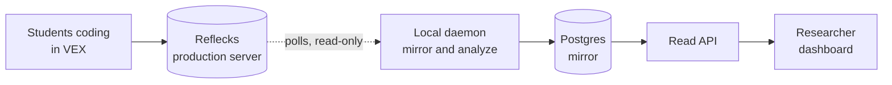

# Learner Modeling Dashboard

A live "who needs help" board for a room of students coding in VEX. It mirrors their
activity from the Reflecks production backend onto your own machine, measures how much
each student's code changes between runs (a plain edit distance, no black-box model),
breaks the session into episodes, and surfaces who needs attention right now
(wheel-spinning, resilience, inactive, explorer, step-by-step) on a single screen. It
only ever reads from production.


```mermaid
flowchart LR
    students["Students coding<br/>in VEX"] --> prod[("Reflecks<br/>production server")]
    prod -. "polls, read-only" .-> daemon["Local daemon<br/>mirror and analyze"]
    daemon --> pg[("Postgres<br/>mirror")]
    pg --> api["Read API"]
    api --> dash["Researcher<br/>dashboard"]
```

> The full documentation is published at <https://inviteinstitute.github.io/lm-dashboard/>
> (or run `mkdocs serve` to read it locally on port 4000).

## Quick Start

All you need is **Docker** (Desktop on Mac/Windows, or Docker + the compose plugin
on Linux). The whole stack - Postgres, the API (which serves the built dashboard),
and the ingestion daemon - runs from one compose file, the same on your laptop and
in prod:

```bash
cp .env.example .env.mirror   # fill in PROD_USERNAME / PROD_PASSWORD
echo "POSTGRES_PASSWORD=$(python3 -c 'import secrets;print(secrets.token_hex(16))')" > .env
make dev                      # or: docker compose up -d
```

`make` (or `make help`) lists the shared command vocabulary - `dev`, `test`, `lint`,
`format`, `build`, `deploy`. See the [Development](https://inviteinstitute.github.io/lm-dashboard/guides/development/) docs.

Open the dashboard, sign in with `PROD_USERNAME` / `PROD_PASSWORD`, add a student ID,
and its data begins flowing while the board is open.

Full setup (dev vs. prod, configuration, accounts) is in the
[Quickstart](https://inviteinstitute.github.io/lm-dashboard/quickstart/) docs.

## What You Get

- A card per student with a **run track** (one tile per run, coloured by how many
  blocks changed since the last run), an **episode** sparkline, a status badge derived
  from their active triggers, and **Present** / **Picked** toggles.
- A live **"who needs help"** column driven by five edit-distance triggers
  (wheel-spinning, resilience, inactive, explorer, step-by-step) where you can jot
  **notes** against each alert. Click any learner for the full detail and notes log.
- A top bar to pause and resume polling, **export** all data as a downloadable zip of
  CSV snapshots, and reset the board.

## Serving It Remotely

Run the prod stack (`docker compose -f compose.yml up -d`) - the API binds to
`127.0.0.1:8000` so nginx (or another reverse proxy) sits in front of it. The whole
origin is gated by **HTTP Basic** (your browser's native login dialog), checked
against the researcher table, so nothing is ever exposed ungated. While served, a
dead-man's switch pauses a board's production polling whenever its dashboard isn't
open.

## Under the Hood

The daemon is the only process that writes. The API and dashboard just read a Postgres
store that can be rebuilt from the raw event log at any time. The full write-up,
covering configuration, the API, and the architecture, lives at
<https://inviteinstitute.github.io/lm-dashboard/>.
