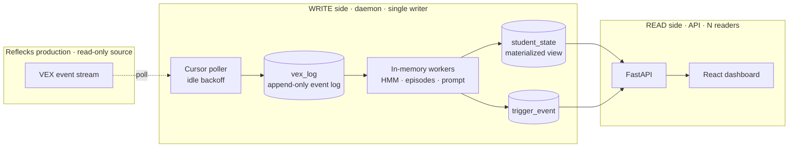

# System Design

A deeper look at how LM Dashboard is put together. For setup and day-to-day usage,
start with the [README](../README.md).

---

## 1. What It Is

A research tool that live-mirrors a production coding-education backend (Reflecks and
VEX) onto a single machine, analyzes student activity locally, and serves a
researcher dashboard. It only ever reads from production: it pulls events over the
prod REST API and never writes back.

Every design choice bends toward one goal, it should run on a researcher's laptop
with almost no setup. No broker, no container orchestration, no managed database. One
Python process, one SQLite file, one web app.

## 2. Processing Model

It's a polled micro-batch model, sitting between classic batch and true streaming.

- Each daemon *tick* pulls the small batch of events that arrived since the last
  cursor position, processes them, and advances. The batch is "whatever showed up in
  the last 0.5 to 5 seconds," usually a handful.
- Within a tick, ingestion is event by event, but inference is debounced. A student
  who got six events in one tick is recomputed once, and triggers run as a single
  sweep over everyone.

The core pattern is CQRS plus a rebuildable materialized view. `vex_log` is an
append-only event log (every row has a unique `source_event_id`). `student_state` is
a projection of it that's fully rebuildable: delete it, replay the log, and you get
identical state back. That event-sourcing-lite property is what makes Reset trivial
and lets the derived tables be treated as a cache.

## 3. Topology And Processes

Two OS processes on one host, connected only through a single SQLite file:

- **Daemon** (`python -m app.pipeline`): the single writer, one blocking tick loop.
- **API** (`uvicorn app.main:app`): a stateless reader, plus tiny writes for track,
  ack, reset, notes, and the polling toggle.
- **SQLite (WAL):** the seam. WAL lets one writer and many readers work at once
  without blocking.

The split is deliberate. The daemon is a long-running compute loop that has to be
exactly one instance (the cursor assumes a single writer), while the API stays light,
ML-free, and safe to restart on its own.

## 4. Write Path (The Daemon)

Tick order: reset-check, then roster/backfill, then drain (ingest), then recompute
dirty workers, then evaluate triggers, then adaptive sleep.

### 4.1 Client And Polling
A normal authenticated REST client (token auth, keep-alive session, re-auth on a
401). Two backoffs doing different jobs:

- **Idle backoff.** 0.5s when active, growing up to `PIPELINE_IDLE_MAX` (5s) when
  idle; any activity resets it. This is what keeps load off prod.
- **Failure backoff.** Exponential up to 30s on errors, logging `UNHEALTHY` after
  five failures in a row. This is just resilience.

### 4.2 Cursor And Idempotency (Lossless Restart)
The most important correctness machinery in the system:

- The cursor is a timestamp (`last_event_time`) plus `last_source_id`.
- Each drain pages prod with `dateFrom = last_event_time - overlap`, a 2s overlap
  window so events sitting on a timestamp boundary don't get skipped.
- It persists, then advances: the cursor only moves after a full drain is safely
  written.
- Inserts are idempotent: every event has a unique `source_event_id`, so re-fetched
  overlap events get dropped (an existence check plus a UNIQUE constraint to catch
  races).
- Net effect: a crash mid-drain just re-fetches the overlap on restart and de-dupes.
  At-least-once delivery plus dedup gives you effectively-once, with nothing lost.

### 4.3 Roster Allowlist And Backfill
The daemon only ingests and computes students on the `tracked_student` allowlist.
Adding a student kicks off a one-time backfill of their recent history (separate from
the cursor) so their card fills in within a tick or two.

### 4.4 Per-Student Workers (In-Memory)
Every tracked student gets a `StudentWorker` holding a rolling `deque(maxlen=5000)`
of recent events. The key choices:

- **Debounced recompute** via a `dirty` flag: once per tick, no matter how many
  events landed.
- **HMM re-decode only on a new run** (`had_new_run`): the HMM's unit is the
  `runProject`, so non-run events reuse the cached decoding.
- **Rehydrate on cold start:** a missing worker reloads its tail from `vex_log` (the
  one SQL read on the hot path). In-memory state is lost on restart but rebuilt
  straight from the log.

### 4.5 Inference
`compute_strategy_states` runs per `runProject`: extract the block AST, compute a
`change_score` with APTED tree-edit-distance against the previous run (with a
hashed-pair cache), bucket it, then feed the HMM (`model.pkl`, loaded lazily) to get
a latent state (iterator, explorer, or stuck). On top of that, every tick segments
the session into episodes (the vendored, dependency-free `app/episode_engine`) and
builds a "playground" LLM prompt from the current blocks.

### 4.6 Triggers
A per-tick sweep, with the lifecycle stored in `trigger_event`:

- **Sustained** (wheel-spin, inactive): open while the condition holds, resolve when
  it clears.
- **Momentary** (big-rewrite): fires once per qualifying run, deduped via
  `json_extract(detail,'$.run_index')`, and is raised from the worker the moment a
  run is decoded rather than from the sweep.

One thing worth noting: wheel-spinning reads the HMM *output* (`current_state == 2`),
while big-rewrite reads the raw `change_score`, which is the HMM's *input feature*
(with its own threshold of 0.5). They sit on opposite sides of the model.

## 5. Data Model And Storage

SQLite in WAL mode with a `busy_timeout` so readers never error out under the writer.
All the SQL is isolated in `app/db.py`, which is what makes a future Postgres swap a
contained change (reimplement `db.py`, keep the signatures).

| Group | Tables | Role |
|---|---|---|
| Event log (truth) | `message`, `vex_log` | append-only raw events, unique `source_event_id` |
| Cursor | `ingest_cursor` | how far we've consumed |
| Read model (cache) | `student_state`, `trigger_event` | materialized projection, rebuildable |
| Roster | `tracked_student` | the allowlist |
| Control | `meta` | cross-process signals (reset and polling flags) |

Two contracts live in `db.py`: a datetime contract (UTC-naive
`%Y-%m-%d %H:%M:%S.%f`, so comparing strings is the same as comparing times for the
cursor and cutoff SQL) and a JSON contract (`runs`, `episodes`, and `detail` stored
as JSON text).

## 6. Read Path (API) And Dashboard

- **API.** FastAPI. Reads the materialized view and shapes it. No ML imports. It
  makes sure the schema exists on load so a fresh clone works no matter which process
  starts first.
- **Dashboard.** Polls `/api/student_states/` (about every 1.5s) and builds the
  student-card grid from that payload; it polls `/api/triggers/` for the who-needs-
  help column and `/api/tracked/` for the roster on the same timer, and the detail
  modal fetches the heavier per-student payload on open. Cards are ordered by
  `studentID` (stable) so a card never jumps when its own data updates.

Why the dashboard is fast: it reads a precomputed materialized view (small, indexed
rows), so the expensive HMM and episode work already happened on the write side. It
still hits SQLite on every request; it's quick because *what* it reads is cheap, not
because of the in-memory workers (those speed up the daemon, not the dashboard).

## 7. Consistency And Coordination

- **Eventual consistency, but bounded.** The read model is at most one tick behind
  the event log, and the UI is at most one poll behind the read model. End to end
  that's roughly a tick plus 1.5s of staleness, which is nothing on human timescales.
- **Coordination is mostly implicit** through SQLite. The one explicit signal is
  Reset: the API stamps `meta.reset_requested_at` and wipes the local data, and the
  daemon notices the flag changed and drops its in-memory workers so they don't
  re-materialize stale state. The cursor is left intact, so the board rebuilds only
  from new activity.

## 8. Failure Modes And Recovery

| Failure | Behavior |
|---|---|
| Crash mid-drain | re-fetch the overlap on restart, dedupe, nothing lost |
| Prod down or 5xx | failure backoff, `UNHEALTHY` log, resumes when prod is back |
| Daemon restart | workers rehydrate from `vex_log`, cursor was persisted |
| Two daemons by mistake | the cursor races; this is the one thing that breaks, so run exactly one |

## 9. Scaling And Evolution

Comfortable at tens of students on one laptop. The first real wall at larger scale is
the daemon's sequential per-student inference, plus the per-tick full-table trigger
sweep. It's not memory; the worker buffers are bounded. The evolution path, in the
order you'd actually need it:

1. **Push-based ingestion.** Have prod publish events (a webhook, Redis Streams,
   NATS) so the daemon subscribes instead of polling. Kills polling latency and idle
   load, and it's the right move before any local message broker.
2. **Postgres.** For multiple cohorts or multiple machines. A contained change,
   because all the SQL lives in `app/db.py`.
3. **Async inference workers.** Only if per-event compute gets heavy, like an LLM
   call per run. A task queue (Celery or RQ plus Redis) offloads that work with
   retries.
4. **Auth** on the mutating endpoints, plus horizontal API workers.

None of these touch the projection logic, and that isolation is the whole payoff of
keeping the write and read sides apart.
