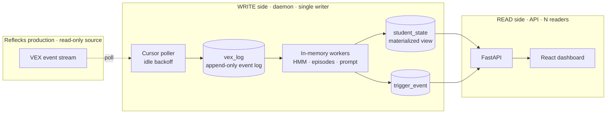

# System Design

In-depth design of the LUC Cohort Dashboard. For setup/usage see the
[README](../README.md).



---

## 1. What it is

A research tool that **live-mirrors** a production coding-education backend
(Reflecks / VEX) onto a single machine, analyzes student activity locally, and
serves a researcher dashboard. It is a **read-only consumer** of production: it
pulls events over the prod REST API and never writes back.

The whole design optimizes for one thing above all: **runs on a researcher's
laptop with minimal setup** — no broker, no container orchestration, no managed
database. One Python process, one SQLite file, one web app.

## 2. Processing model

**Polled micro-batch, not classic batch and not true streaming.**

- Each daemon *tick* pulls the small batch of events that arrived since the last
  cursor position, processes them, and advances. Batch size = "whatever showed up
  in the last 0.5–5s," usually a handful.
- Within a tick: ingestion is event-by-event, but **inference is debounced** — a
  student who got 6 events in one tick is recomputed once, and triggers are a
  single sweep over all students.

The core architectural pattern is **CQRS + a rebuildable materialized view**:

```
 WRITE side (daemon, 1 process)             READ side (API, N readers)
 raw events ─► in-memory workers ─► student_state ──► FastAPI ──► dashboard
 (event log)    (projection)        (materialized view)  (shaping)   (poll)
```

`vex_log` is an **append-only event log** (each row has a unique
`source_event_id`); `student_state` is a **materialized projection** of it that is
*fully rebuildable* — delete it and replay the log to get identical state. That
event-sourcing-lite property is what makes Reset trivial and makes the derived
tables safe to treat as a cache.

## 3. Topology & processes

Two OS processes on one host, coupled only through a single SQLite file:

- **Daemon** (`python -m app.pipeline`) — the **single writer**; a blocking tick loop.
- **API** (`uvicorn app.main:app`) — stateless reader (+ tiny writes for
  track/ack/reset).
- **SQLite (WAL)** — the seam. WAL allows one writer and many concurrent readers
  without blocking.

They are separate processes on purpose: the daemon is a long-running compute loop
that must be exactly one instance (the cursor assumes a sole writer), while the API
should stay lightweight, ML-free, and independently restartable.

## 4. Write path (the daemon)

Tick order: **reset-check → roster/backfill → drain (ingest) → recompute dirty
workers → evaluate triggers → adaptive sleep.**

### 4.1 Client & polling
Authenticated REST client (token auth, keep-alive session, re-auth on 401). Two
independent backoffs:
- **Idle backoff** — 0.5s active → up to `PIPELINE_IDLE_MAX` (5s) when idle; any
  activity resets it. Controls load on prod.
- **Failure backoff** — exponential to 30s on errors; logs `UNHEALTHY` after 5
  consecutive failures. Resilience.

### 4.2 Cursor + idempotency (lossless restart)
The most important correctness machinery:
- Cursor = a **timestamp** (`last_event_time`) plus `last_source_id`.
- Each drain pages prod with `dateFrom = last_event_time − overlap` (a 2s
  **overlap window** so events on a timestamp boundary aren't skipped).
- **Persist-then-advance** — the cursor only moves after a full drain is durably
  written.
- **Idempotent insert** — every event has a unique `source_event_id`; re-fetched
  overlap events are dropped (existence check + a UNIQUE constraint catching races).
- Net effect: a crash mid-drain just re-fetches the overlap on restart and
  de-dupes. At-least-once delivery + dedup ⇒ **effectively-once**, no loss.

### 4.3 Roster allowlist + backfill
The daemon only ingests/computes students on the `tracked_student` allowlist.
Adding a student triggers a one-time **backfill** of their recent history
(independent of the cursor) so their card materializes within a tick or two.

### 4.4 Per-student workers (in-memory)
Each tracked student has a `StudentWorker` holding a rolling `deque(maxlen=5000)`
of recent events. Key choices:
- **Debounced recompute** via a `dirty` flag — once per tick regardless of how
  many events landed.
- **HMM re-decode only on a new run** (`had_new_run`) — the HMM's unit is the
  `runProject`, so non-run events reuse the cached decoding.
- **Rehydrate on cold start** — a missing worker reloads its tail from `vex_log`
  (the only hot-path SQL read). In-memory state is lost on restart but reconstructed
  from the log.

### 4.5 Inference
`compute_strategy_states`: per `runProject`, extract the block AST →
**`change_score`** via APTED tree-edit-distance between consecutive runs (with a
hashed-pair cache) → bucket → HMM (`model.pkl`, lazy-loaded) → latent **state**
(iterator / explorer / stuck). Plus episode segmentation (vendored
`app/episode_engine`, dependency-free) and a "playground" LLM prompt from the
current blocks.

### 4.6 Triggers
A per-tick sweep with lifecycle in `trigger_event`:
- **Sustained** (wheel-spin, inactive) — open while the condition holds, resolve
  when it clears.
- **Momentary** (big-rewrite) — fire once per qualifying run (deduped via
  `json_extract(detail,'$.run_index')`).

Note: **wheel-spinning** reads the HMM *output* (`current_state == 2`), while
**big-rewrite** reads the raw `change_score` (the HMM's *input feature*, with its
own threshold of 0.5) — they sit on opposite sides of the model.

## 5. Data model & storage

SQLite in WAL mode with `busy_timeout` so readers never error under the writer.
All SQL is isolated in `app/db.py` — which is what makes a future Postgres swap a
contained change (reimplement `db.py`, keep the signatures).

| Group | Tables | Role |
|---|---|---|
| Event log (truth) | `message`, `vex_log` | append-only raw events, unique `source_event_id` |
| Cursor | `ingest_cursor` | how far we've consumed |
| Read model (cache) | `student_state`, `trigger_event` | materialized projection, rebuildable |
| Roster | `tracked_student` | the allowlist |
| Control | `meta` | cross-process signal (reset flag) |

Two correctness contracts live in `db.py`: a **datetime** contract (UTC-naive
`%Y-%m-%d %H:%M:%S.%f`, so string comparison equals chronological order for cursor
and cutoff SQL) and a **JSON** contract (`runs` / `episodes` / `detail` stored as
JSON text).

## 6. Read path (API) & dashboard

- **API** — FastAPI. Opens a fresh SQLite connection per request, reads the
  materialized view, shapes it. No ML imports. Ensures the schema exists on load so
  a fresh clone works in any start order.
- **Dashboard** — polls `/api/student_states/` (~1.5s) and derives *both* the
  student-card grid and the "who needs help" column from that one payload; the
  detail modal reuses the same data. Cards are ordered by `studentID` (stable) so a
  card never jumps when its own data updates.

Why the dashboard is fast: it reads a **precomputed materialized view** (small,
indexed rows) — the expensive HMM/episode work already ran on the write side. It
still hits SQLite every request; it's fast because *what* it reads is cheap, not
because of the in-memory workers (those speed up the *daemon*, not the dashboard).

## 7. Consistency & coordination

- **Eventual consistency, bounded:** the read model lags the event log by ≤ one
  tick; the UI lags the read model by ≤ one poll. End-to-end staleness is
  ≤ ~tick + 1.5s — fine for human timescales.
- **Process coordination** is mostly *implicit* through SQLite. The one *explicit*
  signal is **Reset**: the API stamps `meta.reset_requested_at` and wipes the
  local data; the daemon notices the flag changed and drops its in-memory workers
  so they don't re-materialize stale state. The cursor is left intact, so the board
  rebuilds only from new activity.

## 8. Failure modes & recovery

| Failure | Behavior |
|---|---|
| Crash mid-drain | re-fetch overlap on restart, dedupe → lossless |
| Prod down / 5xx | failure backoff, `UNHEALTHY` log, resumes when back |
| Daemon restart | workers rehydrate from `vex_log`; cursor persisted |
| Two daemons (mistake) | cursor races — **the one thing that breaks**; run exactly one |

## 9. Trade-offs

| Decision | Why | Cost |
|---|---|---|
| **Poll, not push** | zero changes to prod; trivial to run | latency floor + idle load (mitigated by backoff) |
| **SQLite, not Postgres** | single host, single writer, tiny data | write-concurrency ceiling; swap path kept open via `db.py` |
| **Separate daemon process** | single-writer invariant; ML off the read path | must supervise it; in-memory state lost on restart (rehydrated) |
| **Materialized read model** | O(1), ML-free reads; debounced writes | derived data can briefly lag |
| **In-memory workers** | hot path avoids SQL (~40ms/student) | memory; cold-start rehydrate |

## 10. Scaling & evolution

Comfortable at tens of students on one laptop. The first real wall at larger scale
is the **single daemon's sequential per-student inference** plus the per-tick
full-table trigger sweep — *not* memory (worker buffers are bounded). Evolution
path, in order of when you'd actually need it:

1. **Push-based ingestion** — have prod publish events (webhook / Redis Streams /
   NATS) so the daemon subscribes instead of polling. Kills polling latency + idle
   load. This is the right next step before any local message broker.
2. **Postgres** — for multiple cohorts or multiple machines. Contained change
   because all SQL lives in `app/db.py`.
3. **Async inference workers** — only if per-event compute gets heavy (e.g. an LLM
   call per run); a task queue (Celery/RQ + Redis) to offload work with retries.
4. **Auth** on the mutating endpoints, and horizontal API workers.

None of these touch the projection logic — that isolation is the payoff of the
CQRS split.
