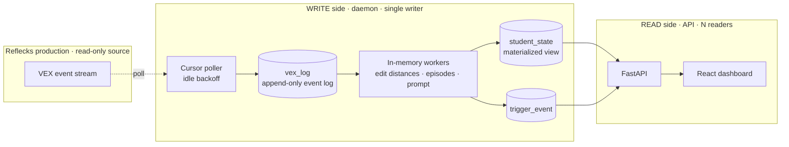

# System Design

A deeper look at how LM Dashboard is put together. For setup and day-to-day usage,
start with the [Quickstart](quickstart.md).

```mermaid
flowchart LR
    subgraph prod["Reflecks production · read-only source"]
        ev["VEX event stream"]
    end

    subgraph write["WRITE side · daemon · single writer"]
        direction TB
        poll["Cursor poller<br/>idle backoff"]
        log[("vex_log<br/>append-only event log")]
        workers["In-memory workers<br/>edit distances · episodes · prompt"]
        state[("student_state<br/>materialized view")]
        trig[("trigger_event")]
        poll --> log --> workers
        workers --> state
        workers --> trig
    end

    subgraph read["READ side · API · N readers"]
        direction TB
        fastapi["FastAPI"]
        ui["React dashboard"]
        fastapi --> ui
    end

    ev -. "poll" .-> poll
    state --> fastapi
    trig --> fastapi
```

---

## 1. What It Is

A research tool that live-mirrors a production coding-education backend (Reflecks and
VEX) onto a single machine, analyzes student activity locally, and serves a
researcher dashboard. It only ever reads from production: it pulls events over the
prod REST API and never writes back.

Every design choice bends toward simplicity of operation: one `docker compose up`
brings up the whole stack — Postgres, the API, and the daemon. It's multi-tenant —
each researcher works on their own isolated board behind a login — while the daemon
serves all the boards from a single shared mirror.

## 2. Processing Model

It's a polled micro-batch model, sitting between classic batch and true streaming.

- Each daemon *tick* pulls the small batch of events that arrived since the last
  cursor position, processes them, and advances. The batch is "whatever showed up in
  the last 0.5 to 5 seconds," usually a handful.
- Within a tick, ingestion is event by event, but inference is debounced. A student
  who got six events in one tick is recomputed once, and triggers run as a single
  sweep over everyone.

The core pattern is CQRS plus a rebuildable materialized view. `vex_log` is an
append-only event log (every row has a unique `source_event_id`). `student_state` is
a projection of it that's fully rebuildable: delete it, replay the log, and you get
identical state back. That event-sourcing-lite property is what makes Reset trivial
and lets the derived tables be treated as a cache.

## 3. Topology And Processes

Three services in one `docker compose` stack, connected through Postgres:

- **daemon** (`python -m app.pipeline`): the single writer, one blocking tick loop,
  fanning out over every board.
- **api** (`uvicorn app.main:app`): a stateless reader (also serves the SPA), plus
  tiny per-board writes for track, ack, reset, notes, and the polling toggle.
- **db** (`postgres`): the seam. MVCC lets the one writer and many readers work at once
  without blocking.

The split is deliberate. The daemon is a long-running compute loop that has to be
exactly one instance (the cursor assumes a single writer), while the API stays light,
ML-free, and safe to restart on its own. The whole origin is behind HTTP Basic Auth,
and each browser is isolated into its own board.

## 4. Write Path (The Daemon)

Tick order: reset-check, then roster/backfill, then drain (ingest), then recompute
dirty workers, then evaluate triggers, then adaptive sleep.

### 4.1 Client And Polling
A normal authenticated REST client (token auth, keep-alive session, re-auth on a
401). Two backoffs doing different jobs:

- **Idle backoff.** 0.5s when active, growing up to `PIPELINE_IDLE_MAX` (5s) when
  idle; any activity resets it. This is what keeps load off prod.
- **Failure backoff.** Exponential up to 30s on errors, logging `UNHEALTHY` after
  five failures in a row. This is just resilience.

### 4.2 Cursor And Idempotency (Lossless Restart)
The most important correctness machinery in the system:

- The cursor is a timestamp (`last_event_time`) plus `last_source_id`.
- Each drain pages prod with `dateFrom = last_event_time - overlap`, a 2s overlap
  window so events sitting on a timestamp boundary don't get skipped.
- It persists, then advances: the cursor only moves after a full drain is safely
  written.
- Inserts are idempotent: every event has a unique `source_event_id`, so re-fetched
  overlap events get dropped (an existence check plus a UNIQUE constraint to catch
  races).
- Net effect: a crash mid-drain just re-fetches the overlap on restart and de-dupes.
  At-least-once delivery plus dedup gives you effectively-once, with nothing lost.

### 4.3 Roster Allowlist And Backfill
The daemon only ingests and computes students on the `tracked_student` allowlist.
Adding a student kicks off a one-time backfill of their recent history (separate from
the cursor) so their card fills in within a tick or two.

### 4.4 Per-Student Workers (In-Memory)
Every tracked student gets a `StudentWorker` holding a rolling `deque(maxlen=5000)`
of recent events. The key choices:

- **Debounced recompute** via a `dirty` flag: once per tick, no matter how many
  events landed.
- **Rehydrate on cold start:** a missing worker reloads its tail from `vex_log` (the
  one SQL read on the hot path), and each trigger's already-fired run indices are
  re-seeded from `trigger_event`. In-memory state is lost on restart but rebuilt
  straight from the log, with no repeated alerts.

### 4.5 Inference
No model, no numpy. `compute_run_edit_distances` runs per `runProject`: extract the
block AST and compute the integer APTED tree-edit-distance against the previous run
(edge-aware costs, so adding a block scores 1; hashed-pair cache to skip repeats).
The result is one number per run, `edit_distance`: `0` for an identical re-run, small
for an incremental edit, large for a structural rewrite. On top of that, every tick
segments the session into episodes (the vendored, dependency-free `app.episode_engine`)
and builds a "playground" LLM prompt from the current blocks.

### 4.6 Triggers
Every rule is defined on the per-run `edit_distance` sequence, with the lifecycle
stored in `trigger_event`:

- **Momentary** (wheel-spin, resilience, explorer, step-by-step): raised from the
  worker the instant a run lands, out of a single pure pass (`detect_run_triggers`),
  each deduped per type via `detail::jsonb->>'run_index'`.
- **Sustained** (inactive): the one time-based rule, opened and resolved by the
  per-tick `evaluate` sweep, with an ack re-alert after `RE_ALERT_SECONDS`.

The five: **wheel-spin** (6+ consecutive `edit_distance == 0`), **resilience** (an
edit after 4+ zeros), **explorer** (a run with `edit_distance >= 13`), **step-by-step**
(6 runs of `edit_distance >= 1`), and **inactive** (idle past 240s). Wheel-spin and
resilience read the same zero-streak from opposite ends, which is why both can fire on
one streak; `TRIGGER_PRIORITY` only decides the headline badge.

## 5. Data Model And Storage

Postgres, all the SQL isolated in `app/db.py` (psycopg, no ORM). The raw mirror and the
derived analysis are **shared** (one per student); the researcher-facing overlay — a
board's roster, notes, picks, alert dismissals, and control flags — is **per-workspace**
(keyed on `workspace_id`). Each browser maps to its own workspace under the shared
login.

| Group | Tables | Role |
|---|---|---|
| Event log (truth) | `message`, `vex_log` | append-only raw events, unique `source_event_id` |
| Cursor | `ingest_cursor` | how far we've consumed |
| Read model (cache) | `student_state`, `trigger_event`, `switch_event` | materialized projection, rebuildable |
| Roster | `tracked_student` | the allowlist, plus presence/picked |
| Researcher input | `note`, `pick_event`, `outbox` | observations, pick history, and failed inputs parked verbatim |
| Control | `meta`, `channel_rev` | cross-process signals (reset and polling flags) plus the per-channel change counters the live stream reads |

Two contracts live in `db.py`: a datetime contract (UTC-naive
`%Y-%m-%d %H:%M:%S.%f`, so comparing strings is the same as comparing times for the
cursor and cutoff SQL) and a JSON contract (`runs`, `episodes`, and `detail` stored
as JSON text).

## 6. Read Path (API) And Dashboard

- **API.** FastAPI. Reads the materialized view and shapes it. No ML imports. It
  makes sure the schema exists on load so a fresh clone works no matter which process
  starts first.
- **Dashboard.** Holds one Server-Sent Events stream (`/api/stream/`); the server
  watches an O(1) per-channel change counter and pushes which of the four channels
  (states, triggers, switches, roster) moved, and the dashboard refetches only those.
  The old four poll loops remain as an automatic fallback when the stream is down.
  The detail modal fetches the heavier per-student payload (playground prompt,
  readable program, trigger history) on open and refreshes it on the same beat.
  Cards are ordered by `studentID` (stable) so a card never jumps when its own data
  updates. Researcher writes go through a resilient path: optimistic UI, short
  retries, then a loud red toast plus the input parked verbatim in the outbox.

Why the dashboard is fast: it reads a precomputed materialized view (small, indexed
rows), so the edit-distance and episode work already happened on the write side. It
still hits Postgres on every request; it's quick because *what* it reads is cheap, not
because of the in-memory workers (those speed up the daemon, not the dashboard). The
per-poll cost also doubles as the daemon's viewer heartbeat, and the frontend pauses
polling whenever its browser tab is hidden.

## 7. Consistency And Coordination

- **Eventual consistency, but bounded.** The read model is at most one tick behind
  the event log, and the UI is at most one stream tick (0.25s) behind the read model,
  or one poll (~1.5s) under the fallback. End to end that's roughly a tick plus a
  quarter second of staleness, which is nothing on human timescales.
- **Coordination is implicit** through Postgres. Reset is a per-board API action that
  clears only that board's own notes/picks/acks and leaves the shared mirror intact, so
  it needs no daemon handshake. Prod-poll gating is per board too: the daemon polls a
  board's students only while that board is un-paused and being watched.

## 8. Failure Modes And Recovery

| Failure | Behavior |
|---|---|
| Crash mid-drain | re-fetch the overlap on restart, dedupe, nothing lost |
| Prod down or 5xx | failure backoff, `UNHEALTHY` log, resumes when prod is back |
| Daemon restart | workers rehydrate from `vex_log`, cursor was persisted |
| Two daemons by mistake | the cursor races; this is the one thing that breaks, so run exactly one |

## 9. Scaling And Evolution

**Postgres, per-researcher auth, and workspace isolation are already in place** (they
used to be on this list). Comfortable from tens of students up through a program's
worth of researchers on their own boards. The first real wall at larger scale is the
daemon's sequential per-student inference, plus the per-tick full-table trigger sweep.
It's not memory; the worker buffers are bounded. The evolution path, in the order you'd
actually need it:

1. **Push-based ingestion.** Have prod publish events (a webhook, Redis Streams,
   NATS) so the daemon subscribes instead of polling. Kills polling latency and idle
   load, and it's the right move before any local message broker.
2. **Async inference workers.** Only if per-event compute gets heavy, like an LLM
   call per run. A task queue (Celery or RQ plus Redis) offloads that work with
   retries.
3. **Per-room SSE + horizontal API workers.** Scope the change stream per board
   (today it's a global signal each board filters), and run more than one read worker.

None of these touch the projection logic, and that isolation is the whole payoff of
keeping the write and read sides apart.
