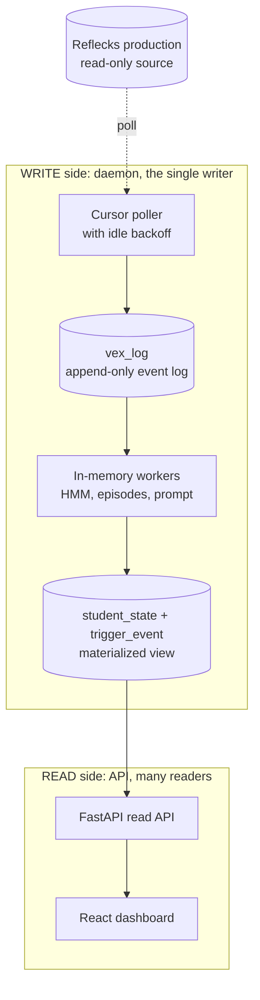

# Architecture

LM Dashboard live-mirrors a production coding-education backend (Reflecks and VEX)
onto a single machine, analyzes student activity locally, and serves a researcher
dashboard. It only ever reads from production: it pulls events over the prod REST
API and never writes back.

The whole thing is built around one goal: it should run on a researcher's laptop
with almost no setup. No message broker, no containers to orchestrate, no managed
database. One Python process, one SQLite file, one web app.

Here's the shape of it. Read it top to bottom: production feeds the daemon, the
daemon writes everything, and the API serves it back out to the dashboard.

## Processing model

It's a polled micro-batch model. Not classic batch, and not true streaming, but
something in between.

- Every daemon *tick* grabs the little batch of events that showed up since the
  last cursor position, processes them, and moves the cursor forward. The batch is
  "whatever arrived in the last 0.5 to 5 seconds," which is usually a handful.
- Inside a tick, ingestion happens event by event, but inference is debounced. A
  student who got six events in one tick is recomputed once, and triggers run as a
  single sweep over everyone.

## CQRS and a rebuildable materialized view

The core idea is to keep the write side and the read side completely separate.

`vex_log` is an append-only event log, and every row has a unique
`source_event_id`. `student_state` is a projection built from that log, and it's
fully rebuildable: delete it, replay the log, and you get the exact same state
back. That property (basically event-sourcing-lite) is what makes
[Reset](../guides/using-the-dashboard.md#reset) trivial and lets you treat the
derived tables as a throwaway cache.

## Topology and processes

Two OS processes on one host, connected only through a single SQLite file.

| Process | Command | Role |
|---|---|---|
| **Daemon** | `python -m app.pipeline` | the single writer, one blocking tick loop |
| **API** | `uvicorn app.main:app` | stateless reader, plus tiny writes for track, ack, reset |
| **SQLite (WAL)** | (the file itself) | the seam; one writer and many readers at once, no blocking |

They're split on purpose. The daemon is a long-running compute loop that has to be
exactly one instance (the cursor assumes a single writer), while the API stays
light, ML-free, and safe to restart on its own.

## Consistency

You get eventual consistency, but it's bounded, and the bound is small:

- The read model is at most one tick behind the event log.
- The UI is at most one poll behind the read model (about 1.5s).
- So end to end you're looking at roughly one tick plus 1.5s of staleness, which is
  nothing on human timescales.

Most of the coordination between the two processes happens implicitly through
SQLite. The one explicit signal is **Reset**: the API stamps
`meta.reset_requested_at` and wipes the local data, the daemon notices the flag
changed, and it drops its in-memory workers so they don't re-materialize stale
state.

## Scaling and evolution

This is comfortable at tens of students on one laptop. The first thing that
actually gives at larger scale is the daemon's sequential per-student inference,
plus the per-tick full-table trigger sweep. It's not memory; the worker buffers are
bounded. Here's the rough order you'd reach for things as you grow:

1.  **Push-based ingestion.** Have prod publish events (a webhook, Redis Streams,
    NATS) so the daemon subscribes instead of polling. This kills both polling
    latency and idle load, and it's the right move before you reach for any local
    message broker.
2.  **Postgres.** Once you've got multiple cohorts or multiple machines. It's a
    contained change, because all the SQL lives in `app/db.py`.
3.  **Async inference workers.** Only if per-event compute gets heavy, like an LLM
    call per run. A task queue (Celery or RQ plus Redis) lets you offload that work
    with retries.
4.  **Auth and horizontal API workers.** Auth on the mutating endpoints, plus more
    than one read worker.

None of these touch the projection logic, and that isolation is the whole payoff of
keeping the write and read sides apart.
