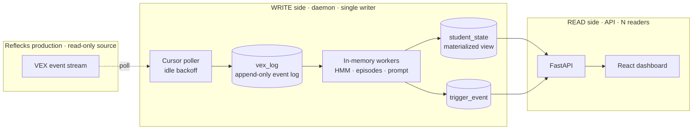

# Architecture

LM Dashboard live-mirrors a production coding-education backend (Reflecks / VEX)
onto a single machine, analyzes student activity locally, and serves a researcher
dashboard. It is a **read-only consumer** of production: it pulls events over the
prod REST API and never writes back.

The whole design optimizes for one thing above all: **runs on a researcher's
laptop with minimal setup**. No broker, no container orchestration, no managed
database. One Python process, one SQLite file, one web app.



## Processing model

It is a **polled micro-batch** model, not classic batch and not true streaming.

- Each daemon *tick* pulls the small batch of events that arrived since the last
  cursor position, processes them, and advances. Batch size is "whatever showed
  up in the last 0.5 to 5 seconds," usually a handful.
- Within a tick, ingestion is event-by-event, but **inference is debounced**: a
  student who got 6 events in one tick is recomputed once, and triggers are a
  single sweep over all students.

## CQRS + a rebuildable materialized view

The core architectural pattern separates the write side from the read side.

```text
 WRITE side (daemon, 1 process)             READ side (API, N readers)
 raw events ─► in-memory workers ─► student_state ──► FastAPI ──► dashboard
 (event log)    (projection)        (materialized view)  (shaping)   (poll)
```

`vex_log` is an **append-only event log** (each row has a unique
`source_event_id`). `student_state` is a **materialized projection** of it that is
*fully rebuildable*: delete it and replay the log to get identical state. That
event-sourcing-lite property is what makes
[Reset](../guides/using-the-dashboard.md#reset) trivial and makes the derived
tables safe to treat as a cache.

## Topology and processes

Two OS processes on one host, coupled only through a single SQLite file.

<div class="grid cards" markdown>

-   :material-cog:{ .lg .middle } **Daemon**

    ---

    `python -m app.pipeline` — the **single writer**, a blocking tick loop.

-   :material-server:{ .lg .middle } **API**

    ---

    `uvicorn app.main:app` — stateless reader, plus tiny writes for track / ack /
    reset.

-   :material-database:{ .lg .middle } **SQLite (WAL)**

    ---

    The seam. WAL allows one writer and many concurrent readers without blocking.

</div>

They are separate processes on purpose: the daemon is a long-running compute loop
that must be exactly one instance (the cursor assumes a sole writer), while the
API stays lightweight, ML-free, and independently restartable.

## Consistency

Consistency is **eventual but bounded**:

- The read model lags the event log by **at most one tick**.
- The UI lags the read model by **at most one poll** (~1.5s).
- End-to-end staleness is therefore roughly **one tick + 1.5s**, fine for human
  timescales.

Process coordination is mostly *implicit* through SQLite. The one *explicit*
signal is **Reset**: the API stamps `meta.reset_requested_at` and wipes the local
data; the daemon notices the flag changed and drops its in-memory workers so they
don't re-materialize stale state.

## Trade-offs

| Decision | Why | Cost |
|---|---|---|
| **Poll, not push** | zero changes to prod; trivial to run | latency floor + idle load (mitigated by backoff) |
| **SQLite, not Postgres** | single host, single writer, tiny data | write-concurrency ceiling; swap path kept open via `db.py` |
| **Separate daemon process** | single-writer invariant; ML off the read path | must supervise it; in-memory state lost on restart (rehydrated) |
| **Materialized read model** | O(1), ML-free reads; debounced writes | derived data can briefly lag |
| **In-memory workers** | hot path avoids SQL (~40ms/student) | memory; cold-start rehydrate |

## Scaling and evolution

Comfortable at tens of students on one laptop. The first real wall at larger
scale is the **single daemon's sequential per-student inference** plus the
per-tick full-table trigger sweep, *not* memory (worker buffers are bounded).
Evolution path, in order of when you'd actually need it:

1.  **Push-based ingestion** — have prod publish events (webhook / Redis Streams
    / NATS) so the daemon subscribes instead of polling. Kills polling latency
    and idle load. This is the right next step before any local message broker.
2.  **Postgres** — for multiple cohorts or multiple machines. A contained change
    because all SQL lives in `app/db.py`.
3.  **Async inference workers** — only if per-event compute gets heavy (for
    example an LLM call per run). A task queue (Celery / RQ + Redis) offloads work
    with retries.
4.  **Auth and horizontal API workers** — auth on the mutating endpoints, plus
    multiple read workers.

None of these touch the projection logic. That isolation is the payoff of the
CQRS split.
