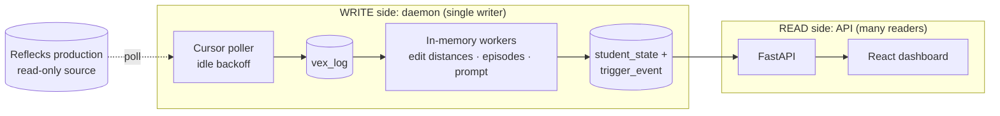

# Architecture

LM Dashboard live-mirrors a production coding-education backend (Reflecks and VEX)
onto a single machine, analyzes student activity locally, and serves a researcher
dashboard. It only ever reads from production: it pulls events over the prod REST API
and never writes back.

The whole thing is built around simplicity: one `docker compose up` brings up the
entire stack - Postgres, the API, and the daemon. No message broker, no managed cloud
services. It's also multi-tenant: each browser works on its own isolated board (no
login - the dashboard is public), while the daemon serves all of them from one shared
mirror.

Here's the shape of it. Read it top to bottom: production feeds the daemon, the daemon
writes everything, and the API serves it back out to the dashboards.

```mermaid
%%{init: {"flowchart": {"nodeSpacing": 35, "rankSpacing": 50}}}%%
flowchart LR
    prod[("Reflecks production<br/>read-only source")]

    subgraph WRITE["WRITE side: daemon (single writer)"]
        direction LR
        poll["Cursor poller<br/>idle backoff"] --> log[("vex_log")] --> workers["In-memory workers<br/>edit distances · episodes · prompt"] --> proj[("student_state +<br/>trigger_event")]
    end

    subgraph READ["READ side: API (many readers)"]
        direction LR
        api["FastAPI"] --> ui["React dashboard"]
    end

    prod -. "poll" .-> poll
    proj --> api
```

## Processing Model

It's a polled micro-batch model, sitting somewhere between classic batch and true
streaming.

- Every daemon *tick* grabs the little batch of events that showed up since the last
  cursor position, processes them, and moves the cursor forward. The batch is
  "whatever arrived in the last 0.5 to 5 seconds," usually a handful.
- Inside a tick, ingestion happens event by event, but inference is debounced. A
  student who got six events in one tick is recomputed once, and triggers run as a
  single sweep over everyone.

## CQRS And A Rebuildable Materialized View

The core idea is to keep the write side and the read side completely separate.

`vex_log` is an append-only event log, and every row has a unique `source_event_id`.
`student_state` is a projection built from that log, and it's fully rebuildable:
delete it, replay the log, and you get the exact same state back. That property
(basically event-sourcing-lite) is what makes
[Reset](../guides/using-the-dashboard.md#reset) trivial and lets you treat the
derived tables as a throwaway cache.

## Topology And Processes

Three containers, one `docker compose` stack, connected through Postgres.

| Service | Command | Role |
|---|---|---|
| **daemon** | `python -m app.pipeline` | the single writer, one blocking tick loop, fans out over every board |
| **api** | `uvicorn app.main:app` | stateless reader (also serves the SPA), plus tiny per-board writes for track, ack, notes |
| **db** | `postgres` | the seam, one writer and many readers at once via MVCC |

The split is on purpose. The daemon is a long-running compute loop that has to be
exactly one instance (the cursor assumes a single writer), while the API stays light,
dependency-free (no numpy, no ML), and safe to restart on its own.

!!! note "Access and serving"
    The dashboard is public - no login - with **Cloudflare Turnstile** gating the API
    against bots rather than authenticating people. Each browser is isolated into its
    own board. In production the API is served behind a reverse proxy (TLS). See
    [Configuration](../guides/configuration.md) for the bot gate and the per-board
    dead-man's switch that keeps prod polling in check.

## Consistency

You get eventual consistency, but it's bounded, and the bound is small:

- The read model is at most one tick behind the event log.
- The UI is at most one stream tick behind the read model: the API watches an O(1)
  per-channel change counter four times a second and pushes over Server-Sent Events,
  so a change lands on screen in about a quarter second (see the
  [read path](read-path.md#the-dashboard)). Under the polling fallback that stretches
  to about 1.5s.
- So end to end you're looking at roughly one daemon tick plus a quarter second,
  which is nothing on human timescales.

Coordination between the processes happens implicitly through Postgres. Reset is a
per-board action now - it clears that board's own researcher data (notes, picks, acks)
and leaves the shared mirror alone - so it needs no daemon handshake.

## Scaling And Evolution

**Postgres** and **per-board workspace isolation** are already in place (they used to
be on this list). This is comfortable from tens of students up through a program's
worth of boards, each isolated. The first thing that actually
gives at larger scale is the daemon's sequential per-student inference, plus the
per-tick full-table trigger sweep. It's not memory. The worker buffers are bounded.
The rough order you'd reach for things as you grow:

1.  **Push-based ingestion.** Have prod publish events (a webhook, Redis Streams,
    NATS) so the daemon subscribes instead of polling. This kills both polling
    latency and idle load.
2.  **Async inference workers.** Only if per-event compute gets heavy, like an LLM
    call per run. A task queue (Celery or RQ plus Redis) lets you offload that work
    with retries.
3.  **Per-room SSE + horizontal API workers.** Scope the change stream per board
    (today it's a global signal each board filters), and run more than one read worker.

None of these touch the projection logic, and that isolation is the whole payoff of
keeping the write and read sides apart.
