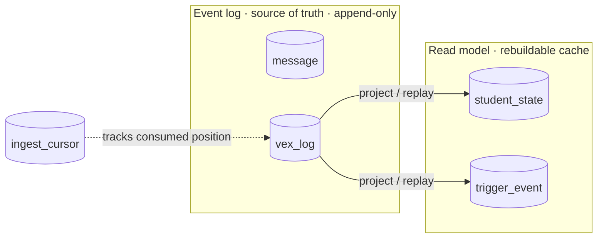

# Data model

All state lives in one SQLite file in WAL mode, with a `busy_timeout` so readers
never error under the writer. All SQL is isolated in `app/db.py`, which is what
makes a future Postgres swap a contained change: reimplement `db.py`, keep the
signatures.

## Tables

| Group | Tables | Role |
|---|---|---|
| Event log (truth) | `message`, `vex_log` | append-only raw events, unique `source_event_id` |
| Cursor | `ingest_cursor` | how far we have consumed |
| Read model (cache) | `student_state`, `trigger_event` | materialized projection, rebuildable |
| Roster | `tracked_student` | the allowlist |
| Control | `meta` | cross-process signal (reset flag) |

!!! tip
    The read-model tables are a **cache** of the event log. Delete them or hit
    [Reset](../guides/using-the-dashboard.md#reset) and they replay from
    `vex_log` to identical state.

## Two correctness contracts

`db.py` enforces two contracts that the rest of the system relies on:

??? note "Datetime contract"
    Timestamps are stored UTC-naive in fixed-width `%Y-%m-%d %H:%M:%S.%f` format.
    Because the format is fixed-width, **string comparison equals chronological
    order**, so the cursor and cutoff SQL (`ORDER BY started_at`, `resolved_at >=
    cutoff`) work directly on the stored strings. Helpers centralize conversion in
    two functions.

??? note "JSON contract"
    The `runs`, `episodes`, and `detail` columns are stored as JSON text and
    converted with `json.loads` / `json.dumps` helpers. SQLite's `json_extract` is
    used where the daemon needs to query inside a blob (for example the
    big-rewrite per-run dedupe on `$.run_index`).

## Event log as truth

`vex_log` is append-only. Each row carries a unique `source_event_id` that makes
ingestion idempotent (see
[Write path](write-path.md#cursor-and-idempotency)). Everything else,
`student_state` and `trigger_event`, is a projection derived from this log. That
is the property that makes the derived tables a disposable cache and makes reset
and recovery trivial.

## Why SQLite

| Reason | Detail |
|---|---|
| Single host, single writer | The daemon is the sole writer; SQLite WAL fits exactly. |
| Tiny data | A classroom's worth of events is megabytes, not gigabytes. |
| Zero setup | No server to install, no connection to manage. A researcher's laptop runs it as-is. |

The cost is a write-concurrency ceiling, but the single-writer design never hits
it. The swap path to Postgres stays open because all SQL is behind `db.py`.
