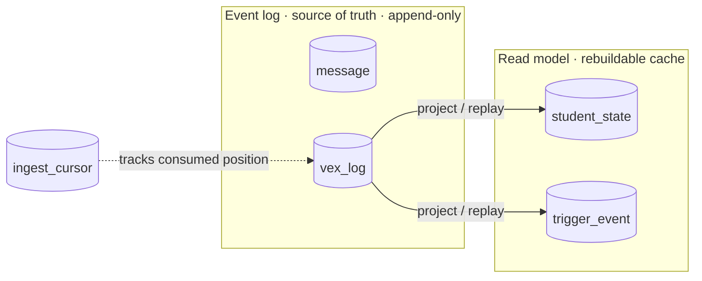

# Data Model

Everything lives in one SQLite file in WAL mode, with a `busy_timeout` set so readers
never error out underneath the writer. All the SQL is tucked away in `app/db.py`,
which is what makes a future Postgres swap a contained job: you reimplement `db.py`
and keep the same function signatures.

## Tables

```mermaid
flowchart LR
    subgraph truth["Event log · source of truth · append-only"]
        msg[("message")]
        vex[("vex_log")]
    end
    subgraph cache["Read model · rebuildable cache"]
        ss[("student_state")]
        te[("trigger_event")]
    end
    cur[("ingest_cursor")]
    vex -->|"project / replay"| ss
    vex -->|"project / replay"| te
    cur -. "tracks consumed position" .-> vex
```

| Group | Tables | Role |
|---|---|---|
| Event log (truth) | `message`, `vex_log` | append-only raw events, unique `source_event_id` |
| Cursor | `ingest_cursor` | how far we've consumed |
| Read model (cache) | `student_state`, `trigger_event`, `switch_event` | the materialized projection, rebuildable |
| Roster | `tracked_student` | the allowlist, plus the presence/picked toggles |
| Researcher input | `note`, `pick_event`, `outbox` | observations, the pick/unpick history, and failed inputs parked verbatim |
| Control | `meta`, `channel_rev` | cross-process signals (reset, polling, disabled triggers, the viewer heartbeat) and the per-channel change counters |

!!! tip
    The read-model tables are just a cache of the event log. Delete them, or hit
    [Reset](../guides/using-the-dashboard.md#reset), and they rebuild from `vex_log`
    to exactly the same state.

### Tables That Are Not A Cache Of The Log

Three tables hold things the event log can't reproduce, so they get treated
differently:

- **`note` and `pick_event`** are the researcher's own judgments. Reset writes them
  into a CSV backup before wiping so nothing is lost.
- **`outbox`** parks a researcher input verbatim when its write failed its retries (a
  crash, or a rare lock). It's the one store with no upstream source to re-pull from,
  so it is deliberately **spared by reset** and rides along in the CSV export. See
  [resilient writes](read-path.md#resilient-writes-and-the-outbox).
- **`channel_rev`** is four counter rows, one per dashboard channel, bumped by SQLite
  triggers on every write to a source table. The live stream reads them as an O(1)
  "what changed?" check instead of scanning the tables (see the
  [read path](read-path.md#the-dashboard)). It's derived state, so a wipe is harmless;
  the triggers rebuild it on the next write.

### Case-Insensitive Identity

A VEX handle is unique only within a class and sometimes arrives in different casing
(`cobra3` vs `Cobra3`). `db.canon_id` folds every derived table onto a lowercase key
so those spellings are one student, while `student_state.display_id` keeps the
most-recent raw casing for the UI. `switch_event` records when a tracked student's
handle casing flips or their handle turns up under a new class code, which is what
drives the identity-switch toasts and feed.

## Two Contracts That Have To Hold

`db.py` enforces two contracts that the rest of the system leans on:

??? note "Datetime Contract"
    Timestamps are stored UTC-naive in fixed-width `%Y-%m-%d %H:%M:%S.%f` format.
    Because the width is fixed, comparing the strings is the same as comparing the
    times, so the cursor and cutoff SQL (`ORDER BY started_at`, `resolved_at >=
    cutoff`) work directly on the stored strings. Two helper functions are the only
    place this conversion happens.

??? note "JSON Contract"
    The `runs`, `episodes`, and `detail` columns are stored as JSON text and go
    through `json.loads` / `json.dumps` helpers. Where the daemon needs to query
    inside a blob, it uses SQLite's `json_extract`, for example the momentary-trigger
    per-run dedupe on `$.run_index`.

## Event Log As Truth

`vex_log` is append-only, and each row carries a unique `source_event_id` that's what
makes ingestion idempotent (see
[Write path](write-path.md#cursor-and-idempotency)). Everything else, `student_state`
and `trigger_event`, is just a projection built from that log. That's the property
that lets you treat the derived tables as a disposable cache, and it's why reset and
recovery are so simple.

## Why SQLite

| Reason | Detail |
|---|---|
| Single host, single writer | The daemon is the only writer, which is exactly what SQLite WAL is good at. |
| Tiny data | A classroom's worth of events is megabytes, not gigabytes. |
| Zero setup | No server to install, no connection string to manage. A laptop runs it as-is. |

The catch is a ceiling on write concurrency, but the single-writer design never gets
near it. And the door to Postgres stays open because all the SQL is behind `db.py`.
