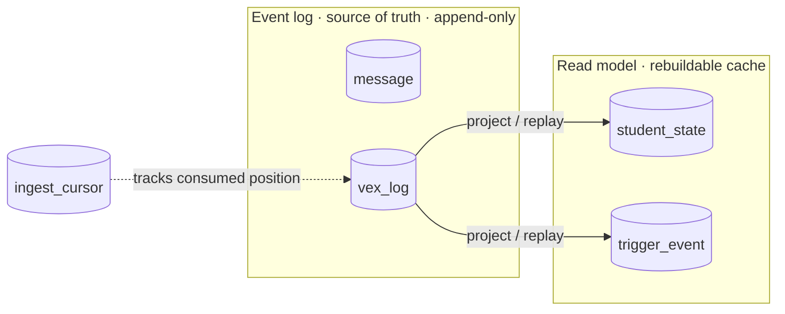

# Data Model

Everything lives in **Postgres**. All the SQL is in `app/db.py` (psycopg 3, no ORM),
which keeps the whole query surface in one place. Postgres MVCC lets the single writer
(the daemon) and the many readers (the API) run at once without blocking. Query bodies
still use `?` placeholders, translated to psycopg's `%s` in one place. Timestamps are
stored as `text` (the fixed-width contract below) and the old SQLite booleans are
`smallint` 0/1.

## Tables

```mermaid
flowchart LR
    subgraph truth["Event log · source of truth · append-only"]
        msg[("message")]
        vex[("vex_log")]
    end
    subgraph cache["Read model · rebuildable cache"]
        ss[("student_state")]
        te[("trigger_event")]
    end
    cur[("ingest_cursor")]
    vex -->|"project / replay"| ss
    vex -->|"project / replay"| te
    cur -. "tracks consumed position" .-> vex
```

| Group | Tables | Role |
|---|---|---|
| Event log (truth) | `message`, `vex_log` | append-only raw events, unique `source_event_id` - **shared** |
| Cursor | `ingest_cursor` | how far we've consumed - shared |
| Read model (cache) | `student_state`, `trigger_event`, `switch_event` | the materialized projection, rebuildable - **shared** (one per student) |
| Tenancy | `workspace`, `workspace_member`, `researcher` | boards, who can access them, and login accounts (argon2 hashes) |
| Roster (per board) | `tracked_student` | a board's allowlist + its presence/picked toggles, keyed `(workspace_id, studentID)` |
| Researcher input (per board) | `note`, `pick_event`, `trigger_ack`, `outbox` | observations, pick/unpick history, per-board alert dismissals, and failed inputs parked verbatim |
| Control (per board) | `workspace_setting` | each board's flags (polling on/off, the viewer heartbeat) |
| Change counters | `channel_rev` | the per-channel "what changed?" counters for the live stream - shared |

!!! tip
    The read-model tables are just a cache of the event log. Delete them, or hit
    [Reset](../guides/using-the-dashboard.md#reset), and they rebuild from `vex_log`
    to exactly the same state.

### Tables That Are Not A Cache Of The Log

Three tables hold things the event log can't reproduce, so they get treated
differently:

- **`note` and `pick_event`** are the researcher's own judgments. Reset writes them
  into a CSV backup before wiping so nothing is lost.
- **`outbox`** parks a researcher input verbatim when its write failed its retries (a
  crash, or a rare lock). It's the one store with no upstream source to re-pull from,
  so it is deliberately **spared by reset** and rides along in the CSV export. See
  [resilient writes](read-path.md#resilient-writes-and-the-outbox).
- **`channel_rev`** is four counter rows, one per dashboard channel, bumped by a
  Postgres trigger function on every write to a source table (which also fires a
  `NOTIFY`). The live stream reads them as an O(1) "what changed?" check instead of
  scanning the tables (see the [read path](read-path.md#the-dashboard)). It's derived
  state, so a wipe is harmless. The trigger rebuilds it on the next write.

### Shared vs. Per-Board

The raw mirror and the derived analysis are a property of the **student**, so they're
**shared** across every board: a student watched by two researchers is pulled from prod
and materialized once. What's **per-board** is the researcher-facing overlay - which
students that board tracks, its notes and picks, its alert dismissals (`trigger_ack`,
since the shared `trigger_event` can't hold one board's ack), and its control flags.
Removing a student from one board only purges the shared mirror once **no** board
tracks them any more.

### Case-Insensitive Identity

A VEX handle is unique only within a class and sometimes arrives in different casing
(`cobra3` vs `Cobra3`). `db.canon_id` folds every derived table onto a lowercase key at
write time so those spellings are one student, while `student_state.display_id` keeps
the most-recent raw casing for the UI. `switch_event` records when a tracked student's
handle casing flips or their handle turns up under a new class code, which drives the
identity-switch toasts and feed.

## Two Contracts That Have To Hold

`db.py` enforces two contracts that the rest of the system leans on:

??? note "Datetime Contract"
    Timestamps are stored UTC-naive in fixed-width `%Y-%m-%d %H:%M:%S.%f` format.
    Because the width is fixed, comparing the strings is the same as comparing the
    times, so the cursor and cutoff SQL (`ORDER BY started_at`, `resolved_at >=
    cutoff`) work directly on the stored strings. Two helper functions are the only
    place this conversion happens.

??? note "JSON Contract"
    The `runs`, `episodes`, and `detail` columns are stored as JSON text and go
    through `json.loads` / `json.dumps` helpers. Where the daemon needs to query
    inside a blob, it casts to `jsonb`, for example the momentary-trigger per-run
    dedupe on `detail->>'run_index'`.

## Event Log As Truth

`vex_log` is append-only, and each row carries a unique `source_event_id` that's what
makes ingestion idempotent (see
[Write path](write-path.md#cursor-and-idempotency)). Everything else, `student_state`
and `trigger_event`, is just a projection built from that log. That's the property
that lets you treat the derived tables as a disposable cache, and it's why reset and
recovery are so simple.

## Why Postgres

| Reason | Detail |
|---|---|
| Concurrent boards | Many researchers on their own boards, all writing (roster, notes, picks) at once - MVCC handles it where SQLite's single-writer lock would contend. |
| Real tenancy | Foreign keys + composite uniques (`(workspace_id, studentID)`) enforce per-board isolation cleanly. |
| LISTEN/NOTIFY | The change-counter trigger emits a notification the live stream can build on. |
| One command | It's a container in the same compose stack, so there's still nothing to install by hand. |

All the SQL stays behind `app/db.py`, which is what kept the move off SQLite a
self-contained rewrite of one file.
