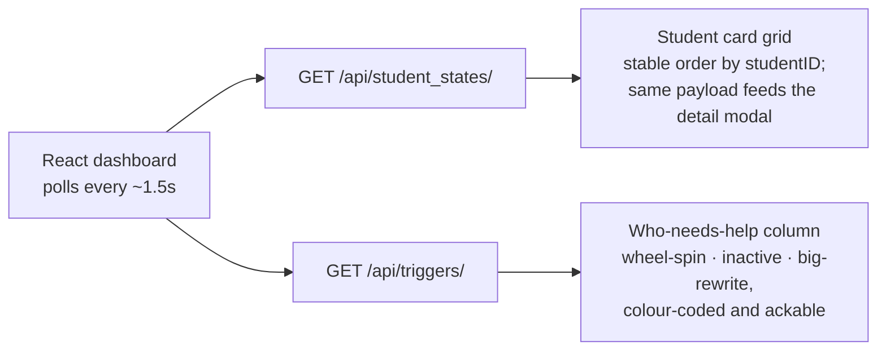

# Read path and dashboard

The read side is deliberately thin. It hands back the state the daemon already
computed and does no machine learning of its own.

## The API

The API is a FastAPI app (`uvicorn app.main:app`), and it does very little:

- It opens a fresh SQLite connection per request, reads the materialized view, and
  shapes it into the dashboard's payload.
- It imports no ML at all. The expensive HMM and episode work already ran on the
  write side.
- It makes sure the schema exists on load, so a fresh clone works whether the API
  or the daemon starts first.

Beyond reads, the API only does tiny writes: add or remove a tracked student, ack a
trigger, signal a reset, pause or resume polling. The [API
reference](../reference/api.md) lists every endpoint.

## The dashboard

The React dashboard polls two endpoints in parallel, each on its own ~1.5s timer:

It polls the roster (`/api/tracked/`) on the same timer too, so adding or removing a
student shows up right away and the alert column can hide alerts for students who
aren't tracked anymore.

## Why the dashboard is fast

It's fast because it reads a precomputed materialized view: small, indexed rows. It
still hits SQLite on every request, but what it's reading is cheap. The speed has
nothing to do with the in-memory workers.

!!! note
    The in-memory workers speed up the daemon, not the dashboard. The dashboard is
    quick purely because it reads a cheap, already-computed projection.

## Payload shape

Every student in `/api/student_states/` carries their full derived state:

| Field | Meaning |
|---|---|
| `current_state` / `current_label` | the latest HMM state (0/1/2) and its label |
| `stuck` / `consecutive_stuck` | the wheel-spin flag and how long it's held |
| `run_count` / `event_count` | activity counters |
| `last_seen` | timestamp of the most recent event |
| `state_sequence` | per-run HMM states (this drives the strategy sparkline) |
| `hmm` | the full HMM blob: runs, observation labels, run count |
| `episodes` | segmented episodes, pauses, and events |
| `block` | the current "playground" LLM prompt and its timestamp |

[Using the dashboard](../guides/using-the-dashboard.md) shows how these actually
render on screen.
