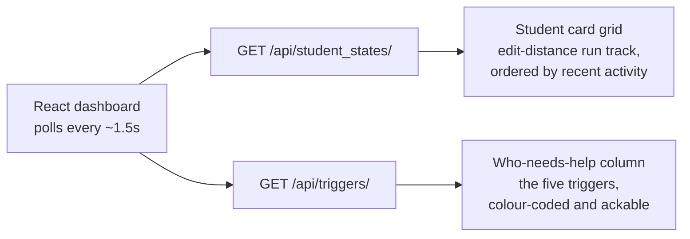

# Read Path And Dashboard

The read side is deliberately thin. It hands back the state the daemon already
computed and does no machine learning of its own.

## The API

The API is a FastAPI app (`uvicorn app.main:app`), and it does very little:

- It reads the materialized view and shapes it into the dashboard's payload.
- It imports no ML at all (there is none). The edit-distance and episode work already
  ran on the write side.
- It makes sure the schema exists on load, so a fresh clone works whether the API or
  the daemon starts first.

Beyond reads, the API only does tiny writes: add or remove a tracked student, ack a
trigger, add a note, toggle presence or picked, signal a reset, pause or resume
polling. The [API reference](../reference/api.md) lists every endpoint.

## The Dashboard

The React dashboard polls a few endpoints, each on its own ~1.5s timer:

```mermaid
flowchart LR
    dash["React dashboard<br/>polls every ~1.5s"]
    dash --> a["GET /api/student_states/"]
    dash --> b["GET /api/triggers/"]
    a --> grid["Student card grid<br/>edit-distance run track,<br/>ordered by recent activity"]
    b --> col["Who-needs-help column<br/>the five triggers,<br/>colour-coded and ackable"]
```

It polls the roster (`/api/tracked/`) on the same timer too, so adding or removing a
student shows up right away and the alert column can hide alerts for students who
aren't tracked anymore. When you open a student's detail modal, it fetches that one
student's heavier payload (the playground prompt included) and keeps it refreshed
while the modal is open, which is why the cohort grid itself can stay light.

!!! note "Polling pauses with the tab"
    Each of those timers is gated on the Page Visibility API: when the browser tab is
    hidden or backgrounded, the dashboard stops polling entirely and resumes (with an
    immediate catch-up fetch) when you return. That keeps a forgotten tab from hitting
    the read API, and it's also the signal behind the daemon's dead-man's switch, since
    the grid poll doubles as a "someone is watching" heartbeat (see
    [Configuration](../guides/configuration.md#the-dead-mans-switch)).

## Why The Dashboard Is Fast

It's fast because it reads a precomputed materialized view: small, indexed rows. It
still hits SQLite on every request, but what it's reading is cheap. The speed has
nothing to do with the in-memory workers.

!!! note
    The in-memory workers speed up the daemon, not the dashboard. The dashboard is
    quick purely because it reads a cheap, already-computed projection.

## Payload Shape

Every student in `/api/student_states/` carries their full derived state:

| Field | Meaning |
|---|---|
| `run_count` / `event_count` | activity counters |
| `last_seen` | timestamp of the most recent event |
| `runs` | `{runs: [{index, edit_distance, ts}], run_count}`, the per-run edit distances that drive the run track (and every trigger) |
| `episodes` | segmented episodes, pauses, and events |
| `updated_at` | when this row was last materialized |
| `block` | the current "playground" LLM prompt and its timestamp (heavy payload only) |

A student's headline status isn't stored on this row; the dashboard derives it from
the [triggers feed](../reference/api.md#get-apitriggers) it already fetches.

[Using the dashboard](../guides/using-the-dashboard.md) shows how these actually
render on screen.
