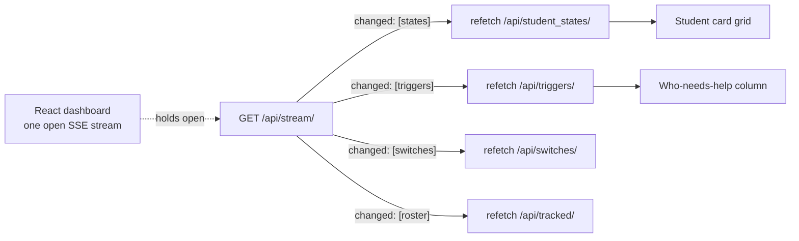

# Read Path And Dashboard

The read side is deliberately thin. It hands back the state the daemon already
computed and does no machine learning of its own.

## The API

The API is a FastAPI app (`uvicorn app.main:app`), and it does very little:

- It reads the materialized view and shapes it into the dashboard's payload.
- It imports no ML at all (there is none). The edit-distance and episode work already
  ran on the write side.
- It makes sure the schema exists on load, so a fresh clone works whether the API or
  the daemon starts first.

Beyond reads, the API only does tiny writes, all scoped to the caller's board: add or
remove a tracked student, ack a trigger or an identity switch, add a note, toggle
presence or picked, reset the board, pause or resume its polling, and park a failed
input in the outbox. The [API reference](../reference/api.md) lists every endpoint.

## The Dashboard

The dashboard used to poll four endpoints on a ~1.5s timer. Now it holds one
long-lived **Server-Sent Events** stream and the server pushes only when something
actually changes:

```mermaid
flowchart LR
    dash["React dashboard<br/>one open SSE stream"]
    api["GET /api/stream/"]
    dash -. "holds open" .-> api
    api -->|"changed: [states]"| a["refetch /api/student_states/"]
    api -->|"changed: [triggers]"| b["refetch /api/triggers/"]
    api -->|"changed: [switches]"| c["refetch /api/switches/"]
    api -->|"changed: [roster]"| d["refetch /api/tracked/"]
    a --> grid["Student card grid"]
    b --> col["Who-needs-help column"]
```

The server watches a cheap per-channel change signal and emits a `changed` event
naming just the channels that moved (`states`, `triggers`, `switches`, `roster`); the
dashboard refetches only those. So an idle board sits on one quiet connection instead
of firing ~160 requests a minute, and a change lands on screen in about a quarter
second instead of up to a poll interval. When you open a student's detail modal it
fetches that one student's heavier payload (the playground prompt and the readable
program included) and refreshes it when the `states` channel changes, which is why the
cohort grid itself can stay light.

!!! note "Polling is the automatic fallback"
    The four poll timers are still in the code, gated on the stream *not* being
    connected. If the browser has no `EventSource`, or the stream drops, the dashboard
    silently falls back to polling and reconnects on its own, so the board can never go
    stale. Either way the loop is gated on the Page Visibility API: a hidden or
    backgrounded tab closes the stream and pauses the timers, which is also the signal
    behind the daemon's dead-man's switch, since an open stream doubles as a "someone
    is watching" heartbeat (see
    [Configuration](../guides/configuration.md#the-dead-mans-switch)).

!!! tip "Responses are gzipped"
    The API runs gzip compression on any response over ~1KB, so the heavier payloads
    (the run arrays, the playground prompt) compress roughly 10x on the wire. It
    matters most over the remote tunnel. The SSE stream opts out (it is sent with
    `Content-Encoding: identity`) so events are never buffered inside a compression
    window.

## Why The Dashboard Is Fast

It's fast because it reads a precomputed materialized view: small, indexed rows. It
still hits Postgres on every request, but what it's reading is cheap (and scoped to
the board's roster). The speed has nothing to do with the in-memory workers.

!!! note
    The in-memory workers speed up the daemon, not the dashboard. The dashboard is
    quick purely because it reads a cheap, already-computed projection.

## Payload Shape

Every student in `/api/student_states/` carries their full derived state:

| Field | Meaning |
|---|---|
| `display` | the student's handle in its most-recent casing (identity is folded case-insensitively; the raw casing is kept for the UI) |
| `run_count` / `event_count` | activity counters |
| `last_seen` | timestamp of the most recent event |
| `runs` | `{runs: [{index, edit_distance, ts}], run_count}`, the per-run edit distances that drive the run track (and every trigger) |
| `episodes` | segmented episodes, pauses, and events |
| `updated_at` | when this row was last materialized |
| `block` | the current "playground" LLM prompt, its timestamp, and a `readable` program listing (heavy payload only) |

A student's headline status isn't stored on this row; the dashboard derives it from
the [triggers feed](../reference/api.md#get-apitriggers) it already fetches.

## Resilient Writes And The Outbox

Every read on the board can be recomputed from the log, but a researcher's inputs
(presence, picked, notes, acks, roster edits) have no upstream source, so they get the
most protection. Every one of those clicks goes through a single write path on the
dashboard:

1.  **Optimistic.** The UI applies the change immediately.
2.  **Retry.** The write is retried a couple of times with a short backoff, so a
    transient error resolves invisibly.
3.  **Fail loud.** If it still can't land, the raw input is parked in the `outbox`
    table (via [`POST /api/outbox/`](../reference/api.md#post-apioutbox)), or in the
    browser's `localStorage` when the API itself is unreachable, and a sticky red
    "NOT saved" toast names the action. The browser-parked copy is flushed to the
    server outbox the moment the stream reconnects.

So an input is never silently dropped. The `outbox` is spared by
[Reset](../guides/using-the-dashboard.md#reset) and included in the CSV export, and
[`GET /api/outbox/`](../reference/api.md#get-apioutbox) lists anything parked for
inspection or replay.

[Using the dashboard](../guides/using-the-dashboard.md) shows how these actually
render on screen.
