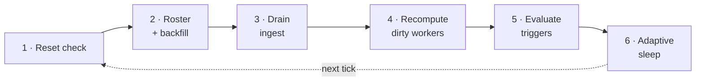
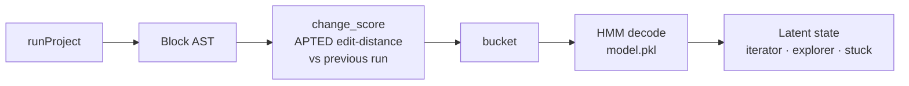
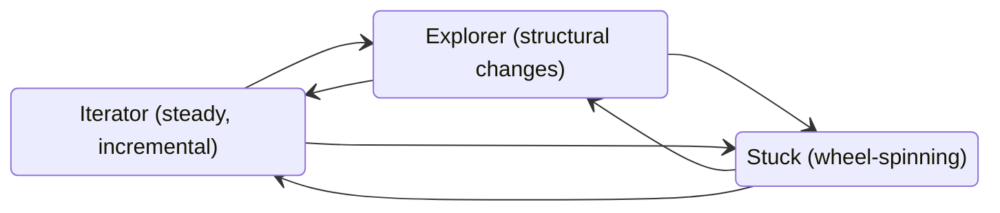
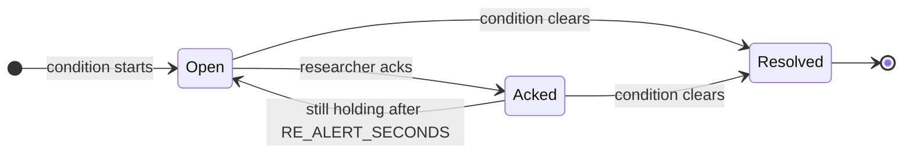

# Write path (the daemon)

The daemon (`python -m app.pipeline`) is the only thing in the system that writes.
It's one blocking loop, and every pass through it runs the whole pipeline start to
finish.

## Tick order

Each tick goes through these stages in order:

1.  **Reset check.** Look at the `meta.reset_requested_at` flag, and if it changed,
    drop the in-memory workers.
2.  **Roster and backfill.** Reconcile the tracked allowlist and backfill any
    student who was just added.
3.  **Drain (ingest).** Pull everything new since the cursor and persist it
    idempotently.
4.  **Recompute dirty workers.** Re-run inference once per student who got events
    this tick.
5.  **Evaluate triggers.** One sweep over all students to open and resolve
    intervention flags.
6.  **Adaptive sleep.** Wait for the current poll interval, with idle backoff
    applied.

## Client and polling

The client is a normal authenticated REST client (token auth, a keep-alive
session, re-auth on a 401). It has two backoffs that do different jobs:

- **Idle backoff.** 0.5s when things are active, growing up to `PIPELINE_IDLE_MAX`
  (5s) when nothing's happening. Any activity resets it. This is what keeps load
  off prod.
- **Failure backoff.** Exponential up to 30s when requests error out, and it logs
  `UNHEALTHY` after five failures in a row. This is just resilience.

!!! tip
    Poll load tracks event volume, not how many students you're tracking. Thanks to
    the backoff, a quiet cohort barely touches prod no matter how big the roster is.

## Cursor and idempotency

This is the part that makes a restart lossless, and it's the most important bit of
correctness machinery in the whole thing.

- The cursor is a timestamp (`last_event_time`) plus `last_source_id`.
- Each drain pages prod with `dateFrom = last_event_time - overlap`, where overlap
  is a 2-second window, so events sitting right on a timestamp boundary don't slip
  through.
- It persists, then advances. The cursor only moves after a full drain is safely
  written.
- Inserts are idempotent. Every event has a unique `source_event_id`, so re-fetched
  overlap events get dropped (there's an existence check, plus a `UNIQUE`
  constraint to catch races).

Put it together and a crash mid-drain is a non-event: on restart it just re-fetches
the overlap and de-dupes. At-least-once delivery plus dedup gives you
effectively-once processing, with nothing lost.

## Roster allowlist and backfill

The daemon only ingests and computes students on the `tracked_student` allowlist.
When you add a student, that kicks off a one-time backfill of their recent history
(separate from the cursor) so their card fills in within a tick or two.

## Per-student workers

Every tracked student gets a `StudentWorker` that holds a rolling
`deque(maxlen=5000)` of recent events.

- **Debounced recompute.** A `dirty` flag means a worker recomputes once per tick,
  no matter how many events landed.
- **HMM re-decode only on a new run.** The HMM's unit is the `runProject`, so when
  `had_new_run` is false, non-run events just reuse the cached decoding.
- **Rehydrate on cold start.** If a worker is missing, it reloads its tail from
  `vex_log` (the one SQL read on the hot path). In-memory state is lost on restart,
  but it's reconstructed straight from the log.

## Inference

`compute_strategy_states` runs once per `runProject`:

1.  **Extract the block AST.** Parse the student's current blocks into a tree.
2.  **Compute `change_score`.** APTED tree-edit-distance between this run and the
    last one, with a hashed-pair cache so you don't recompute the same comparison.
3.  **Bucket and decode.** Bucket the score, then feed the HMM (`model.pkl`, loaded
    lazily) to get a latent state: iterator, explorer, or stuck.

The HMM moves a student between those three strategy states run to run, and the
**stuck** state is exactly what the wheel-spin flag watches:

On top of strategy, every tick also segments the session into episodes (that's the
vendored, dependency-free `app/episode_engine` package) and builds a "playground"
LLM prompt describing the current blocks. The [Read path](read-path.md) page
covers how all of this surfaces.

## Triggers

Triggers run as a per-tick sweep, with their lifecycle stored in `trigger_event`.
There are two kinds:

- **Sustained** (wheel-spin, inactive). Open while the condition holds, resolve
  when it clears. For wheel-spin, `started_at` is the timestamp of the first run in
  the current stuck streak, not the tick that happened to notice it, so the alert's
  age matches what the student actually went through.
- **Momentary** (big-rewrite). Fires once per qualifying run, deduped with
  `json_extract(detail,'$.run_index')`. The evaluator looks at every run in the
  materialized state, not just the latest one, so a backfill or a batch decode
  can't quietly drop alerts for runs in the middle.

A sustained trigger moves through this lifecycle (re-alert is covered just below):

!!! note "Same model, opposite sides"
    Wheel-spinning reads the HMM *output* (`current_state == 2`), while big-rewrite
    reads the raw `change_score`, which is the HMM's *input feature*, with its own
    threshold of 0.5. They sit on opposite sides of the model.

### Re-alert on persistent conditions

Acking a sustained trigger doesn't silence it forever. If the condition keeps
holding for another `RE_ALERT_SECONDS` (10 minutes) past the acked row's
`started_at`, the evaluator closes that row and opens a fresh, unacked one. So a
student who genuinely stays stuck keeps coming back to the feed instead of
disappearing after a single ack.
