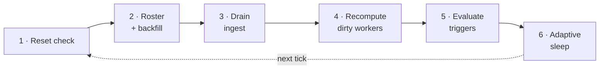

# Write path (the daemon)

The daemon (`python -m app.pipeline`) is the **only writer** in the system. It is
a blocking tick loop that runs the full pipeline on each pass.

## Tick order

Each tick runs these stages in order:

1.  **Reset check** — notice the `meta.reset_requested_at` flag and drop
    in-memory workers if it changed.
2.  **Roster and backfill** — reconcile the tracked allowlist; backfill any newly
    added student's history.
3.  **Drain (ingest)** — pull new events since the cursor and persist them
    idempotently.
4.  **Recompute dirty workers** — re-run inference once per student that received
    events this tick.
5.  **Evaluate triggers** — a single sweep over all students to open and resolve
    intervention flags.
6.  **Adaptive sleep** — sleep for the current poll interval, applying idle
    backoff.

## Client and polling

An authenticated REST client (token auth, keep-alive session, re-auth on 401)
with two independent backoffs:

- **Idle backoff** — 0.5s when active, up to `PIPELINE_IDLE_MAX` (5s) when idle;
  any activity resets it. Controls load on prod.
- **Failure backoff** — exponential up to 30s on errors; logs `UNHEALTHY` after 5
  consecutive failures. Provides resilience.

!!! tip
    Poll load is a function of **event volume**, not the number of tracked
    students. The backoff means a quiet cohort barely touches prod.

## Cursor and idempotency

This is the most important correctness machinery and what makes a restart
lossless.

- The cursor is a **timestamp** (`last_event_time`) plus `last_source_id`.
- Each drain pages prod with `dateFrom = last_event_time − overlap`, a **2-second
  overlap window** so events on a timestamp boundary aren't skipped.
- **Persist-then-advance**: the cursor only moves after a full drain is durably
  written.
- **Idempotent insert**: every event has a unique `source_event_id`; re-fetched
  overlap events are dropped (existence check plus a `UNIQUE` constraint catching
  races).

The net effect: a crash mid-drain just re-fetches the overlap on restart and
de-dupes. At-least-once delivery plus dedup gives **effectively-once** processing
with no loss.

## Roster allowlist and backfill

The daemon only ingests and computes students on the `tracked_student`
allowlist. Adding a student triggers a one-time **backfill** of their recent
history (independent of the cursor) so their card materializes within a tick or
two.

## Per-student workers

Each tracked student has a `StudentWorker` holding a rolling
`deque(maxlen=5000)` of recent events.

- **Debounced recompute** via a `dirty` flag: once per tick, regardless of how
  many events landed.
- **HMM re-decode only on a new run** (`had_new_run`): the HMM's unit is the
  `runProject`, so non-run events reuse the cached decoding.
- **Rehydrate on cold start**: a missing worker reloads its tail from `vex_log`
  (the only hot-path SQL read). In-memory state is lost on restart but
  reconstructed from the log.

## Inference

`compute_strategy_states` runs per `runProject`:

1.  **Extract the block AST** — parse the student's current blocks into an
    abstract syntax tree.
2.  **Compute change_score** — APTED tree-edit-distance between consecutive runs
    (with a hashed-pair cache).
3.  **Bucket and decode** — bucket the score, then feed the HMM (`model.pkl`,
    lazy-loaded) to get a latent **state**: iterator, explorer, or stuck.

Alongside strategy, each tick also runs **episode segmentation** (the vendored,
dependency-free `app/episode_engine` package) and builds a "playground" LLM
prompt describing the current blocks. See [Read path](read-path.md) for how this
surfaces.

## Triggers

A per-tick sweep with a lifecycle stored in `trigger_event`:

- **Sustained** (wheel-spin, inactive) — open while the condition holds, resolve
  when it clears. `started_at` for wheel-spin is the timestamp of the first
  run in the current stuck streak, not the tick that noticed it, so the alert's
  age matches the student's actual experience.
- **Momentary** (big-rewrite) — fire once per qualifying run, deduped via
  `json_extract(detail,'$.run_index')`. The evaluator scans **every run** in
  the materialized state, not just the latest, so a backfill or batch decode
  cannot drop alerts for intermediate qualifying runs.

!!! note "Same model, opposite sides"
    **Wheel-spinning** reads the HMM *output* (`current_state == 2`), while
    **big-rewrite** reads the raw `change_score` (the HMM's *input feature*,
    with its own threshold of 0.5). They sit on opposite sides of the model.

### Re-alert on persistent conditions

Acknowledging a sustained trigger does not silence it forever. If the
condition keeps holding for another **`RE_ALERT_SECONDS`** (10 min) past the
acked row's `started_at`, the evaluator closes the acked row and opens a
fresh unacked one. The effect: a student who genuinely stays stuck keeps
re-surfacing in the feed instead of disappearing after one ack.
