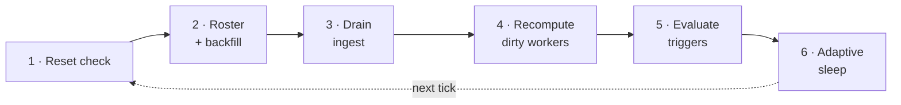
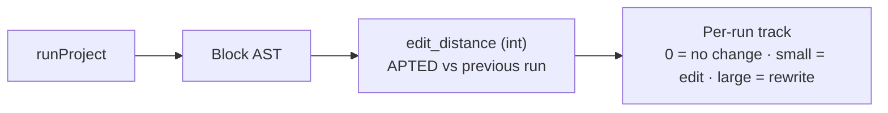
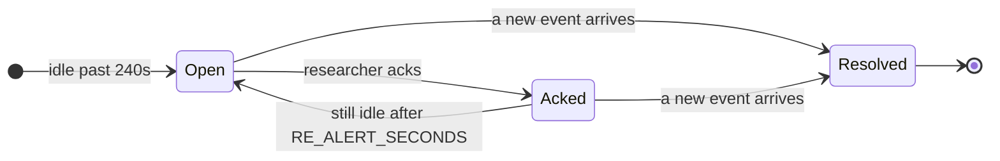

# Write Path (The Daemon)

The daemon (`python -m app.pipeline`) is the only thing in the system that writes.
It's one blocking loop, and every pass through it runs the whole pipeline start to
finish.

## Tick Order

```mermaid
flowchart LR
    a["1 · Reset check"] --> b["2 · Roster<br/>+ backfill"] --> c["3 · Drain<br/>ingest"]
    c --> d["4 · Recompute<br/>dirty workers"] --> e["5 · Evaluate<br/>triggers"] --> f["6 · Adaptive<br/>sleep"]
    f -. "next tick" .-> a
```

Each tick moves through these stages in order:

1.  **Reset check.** Look at the `meta.reset_requested_at` flag, and if it changed,
    drop the in-memory workers.
2.  **Roster and backfill.** Reconcile the tracked allowlist and backfill any student
    who was just added.
3.  **Drain (ingest).** Pull everything new since the cursor and persist it
    idempotently.
4.  **Recompute dirty workers.** Re-run inference once per student who got events
    this tick.
5.  **Evaluate triggers.** One sweep over all students to open and resolve
    intervention flags.
6.  **Adaptive sleep.** Wait for the current poll interval, with idle backoff
    applied.

## Client And Polling

The client is a normal authenticated REST client (token auth, a keep-alive session,
re-auth on a 401). It has two backoffs that do different jobs:

- **Idle backoff.** 0.5s when things are active, growing up to `PIPELINE_IDLE_MAX`
  (5s) when nothing's happening. Any activity resets it. This is what keeps load off
  prod.
- **Failure backoff.** Exponential up to 30s when requests error out, and it logs
  `UNHEALTHY` after five failures in a row. This is just resilience.

!!! tip
    Poll load tracks event volume, not how many students you're tracking. Thanks to
    the backoff, a quiet cohort barely touches prod no matter how big the roster is.

## Cursor And Idempotency

This is the part that makes a restart lossless, and it's the most important bit of
correctness machinery in the whole thing.

- The cursor is a timestamp (`last_event_time`) plus `last_source_id`.
- Each drain pages prod with `dateFrom = last_event_time - overlap`, where overlap is
  a 2-second window, so events sitting right on a timestamp boundary don't slip
  through.
- It persists, then advances. The cursor only moves after a full drain is safely
  written.
- Inserts are idempotent. Every event has a unique `source_event_id`, so re-fetched
  overlap events get dropped (there's an existence check, plus a `UNIQUE` constraint
  to catch races).

Put it together and a crash mid-drain is a non-event: on restart it just re-fetches
the overlap and de-dupes. At-least-once delivery plus dedup gives you effectively-once
processing, with nothing lost.

## Roster Allowlist And Backfill

The daemon only ingests and computes students on the `tracked_student` allowlist.
When you add a student, that kicks off a one-time backfill of their recent history
(separate from the cursor) so their card fills in within a tick or two.

## Per-Student Workers

Every tracked student gets a `StudentWorker` that holds a rolling
`deque(maxlen=5000)` of recent events.

- **Debounced recompute.** A `dirty` flag means a worker recomputes once per tick, no
  matter how many events landed.
- **Rehydrate on cold start.** If a worker is missing, it reloads its tail from
  `vex_log` (the one SQL read on the hot path). In-memory state is lost on restart,
  but it's reconstructed straight from the log, and each trigger's already-fired run
  indices are re-seeded from `trigger_event` so a restart can't repeat old alerts.

## Inference

There is no machine-learning model here anymore, no HMM, no numpy, no `model.pkl`.
Inference is a single deterministic number per run: the **edit distance** between one
`runProject` and the previous one.

`compute_run_edit_distances` walks a student's runs in order and, for each one:

1.  **Extract the block AST.** Parse the student's current blocks into a tree.
2.  **Compute the edit distance.** APTED tree-edit-distance against the previous run,
    rounded to an integer, with a hashed-pair cache so the same comparison isn't
    recomputed. The costs are edge-aware (adding a block scores 1, not 2), so the
    number reads as "how many blocks changed."

```mermaid
flowchart LR
    run["runProject"] --> ast["Block AST"]
    ast --> ed["edit_distance (int)<br/>APTED vs previous run"]
    ed --> track["Per-run track<br/>0 = no change · small = edit · large = rewrite"]
```

The first run has no predecessor, so its `edit_distance` is `null`. Every later run
gets an integer: `0` means the student re-ran identical code, a small number is an
incremental edit, a large one is a structural rewrite. That single sequence of
integers is all five triggers read.

On top of the edit distances, every tick also segments the session into episodes (the
vendored, dependency-free `app.episode_engine` package) and builds a "playground" LLM
prompt describing the current blocks. The [Read path](read-path.md) page covers how
all of this surfaces.

## Triggers

Every intervention rule is defined on the per-run `edit_distance` sequence. Their
lifecycle is stored in `trigger_event`, and there are two kinds:

- **Momentary** (wheel-spin, resilience, explorer, iterative). These fire from the
  worker the instant a run lands, straight out of `detect_run_triggers`, a single pure
  pass over the edit-distance list. Each is deduped per type by `run_index` (via
  `json_extract(detail,'$.run_index')`), and the dedupe set is seeded from the
  database on rehydrate, so a backfill or restart can't drop or repeat a run's alert.
- **Sustained** (inactive). The one time-based rule, evaluated by the per-tick
  `evaluate` sweep: it opens while a student is idle past
  `INACTIVE_TRIGGER_SECONDS`, stays fresh while idle, and resolves when a new event
  arrives.

The five rules:

| Trigger | Type | Fires when |
|---|---|---|
| **Wheel-spinning** | momentary | `WHEEL_SPIN_ZERO_RUNS` (6) consecutive `edit_distance == 0` runs; silent until a real edit re-arms it |
| **Resilience** | momentary | a real edit (`edit_distance > 0`) right after `RESILIENCE_ZERO_RUNS` (4) or more zeros |
| **Explorer** | momentary | a single run with `edit_distance >= EXPLORER_EDIT_DISTANCE` (13) |
| **Step-by-Step** | momentary | the count of runs with `edit_distance >= 1` reaches the iterative threshold (per playground, default 6); resets on a zero-edit run |
| **Inactive** | sustained | no event for at least `INACTIVE_TRIGGER_SECONDS` (240s / 4 min) |

!!! note "Analyzed per playground"
    A student can switch VEX playgrounds mid-session, and diffing code from one
    challenge against another is meaningless. So the run sequence is sliced into
    contiguous same-playground stretches (each run carries its `playground`, read from
    the telemetry). At every switch the baseline resets, the first run of the new
    stretch gets a `null` `edit_distance`, and all four momentary triggers count only
    within the current stretch, so a challenge switch (or jumping back to an earlier
    one) starts every counter fresh. Step-by-Step also picks its threshold per stretch
    from `ITERATIVE_THRESHOLDS` (`CastleCrasherPlus` 6, `CoralReefRescue` 5,
    `RoverRescue` 3), falling back to `ITERATIVE_DEFAULT_THRESHOLD` (6) for any
    unlisted playground. `detect_run_triggers` stays a pure single-stretch function;
    the segmentation wraps it in `detect_run_triggers_by_playground`.

!!! note "Wheel-spin and resilience are two sides of one streak"
    On the sequence `[0 0 0 0 0 0 1]`, wheel-spin fires on the sixth zero (the student
    is stuck re-running identical code) and resilience fires on the `1` (they finally
    made a real edit). Both are logged; `TRIGGER_PRIORITY` only decides which one wins
    the card's headline badge (`wheel_spin` outranks `resilience`).

### Re-Alert On A Persistent Inactive

The one sustained trigger, inactive, moves through this lifecycle:

```mermaid
stateDiagram-v2
    direction LR
    [*] --> Open: idle past 240s
    Open --> Resolved: a new event arrives
    Open --> Acked: researcher acks
    Acked --> Resolved: a new event arrives
    Acked --> Open: still idle after RE_ALERT_SECONDS
    Resolved --> [*]
```

Acking it doesn't silence it forever: if the student stays idle for another
`RE_ALERT_SECONDS` (10 minutes) past the acked row's `started_at`, the evaluator
closes that row and opens a fresh, unacked one, so someone who never came back keeps
resurfacing in the feed.
