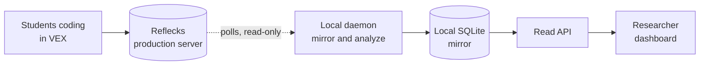

# LM Dashboard

LM Dashboard is a live **"who needs help"** view for a cohort of students coding
in the VEX block environment. It mirrors student activity from the Reflecks
production backend onto a local machine, infers each student's coding
**strategy** with a Hidden Markov Model, segments their session into
**episodes**, raises **intervention flags** (wheel-spinning, idle, big rewrite),
and shows it all on a single researcher dashboard.

## How it works in one paragraph

Students code in VEX; their logs land in the **Reflecks production server**. A
local **daemon** polls that server's REST API for new events (cursor-based, with
idle backoff), stores the raw logs in a local SQLite file, and continuously
computes each tracked student's derived state (strategy, episodes, flags) into a
**materialized table**. A small **read API** serves that table to a **React
dashboard**. The daemon is the *only writer*; the dashboard never recomputes
anything, it just reads precomputed state. Nothing is ever written back to
production, it is a read-only mirror.

## What you get

-   :material-brain:{ .lg .middle } **Strategy inference**

    ---

    An HMM classifies each student into Iterator, Explorer, or Stuck from how
    their code changes between runs.

-   :material-layers-triple:{ .lg .middle } **Episode segmentation**

    ---

    Each session is carved into code / run / reset episodes with pause detection.

-   :material-hand-back-right:{ .lg .middle } **Intervention flags**

    ---

    Wheel-spinning, inactivity, and big-rewrite triggers surface the students who
    need attention now.

-   :material-shield-check:{ .lg .middle } **Read-only mirror**

    ---

    Production is never written to. Everything runs on one laptop with one SQLite
    file.

## Where to go next

-   :material-rocket-launch:{ .lg .middle } **[Quickstart](quickstart.md)**

    ---

    Install, configure credentials, and run all three processes.

-   :material-sitemap:{ .lg .middle } **[Architecture](concepts/architecture.md)**

    ---

    The CQRS + materialized-view design and the polled micro-batch model.

-   :material-monitor:{ .lg .middle } **[Using the dashboard](guides/using-the-dashboard.md)**

    ---

    Student cards, the who-needs-help column, drill-down, and reset.

-   :material-code-tags:{ .lg .middle } **[API reference](reference/api.md)**

    ---

    Every endpoint the read API exposes.

