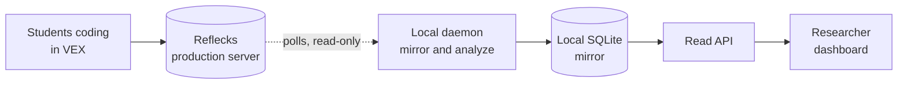
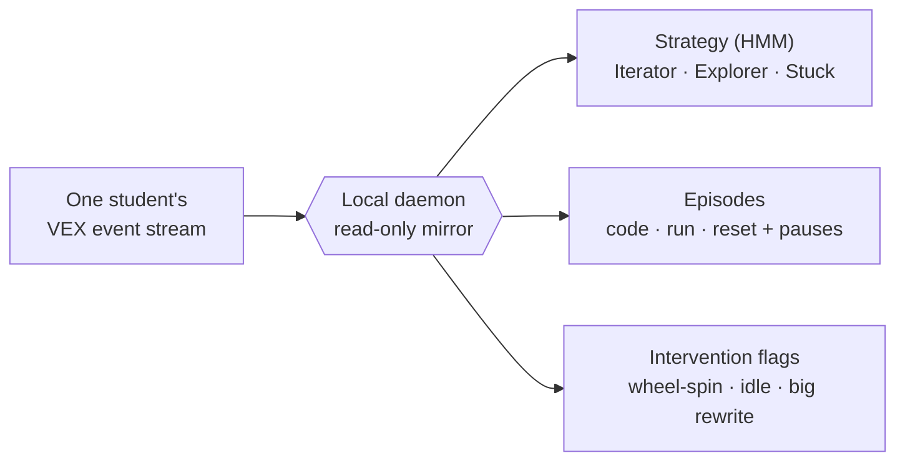

# LM Dashboard

LM Dashboard is a live "who needs help" view for a room full of students coding in
the VEX block environment. It mirrors what they're doing from the Reflecks
production backend onto your own machine, figures out each student's coding
**strategy** with a Hidden Markov Model, breaks their session into **episodes**,
raises **intervention flags** when someone's wheel-spinning, idle, or rewriting
everything, and puts it all on one screen for you.

## How it works, in one paragraph

Students code in VEX, and their logs land in the Reflecks production server. A
local **daemon** asks that server's REST API for new events (it keeps a cursor and
backs off when things are quiet), drops the raw logs into a local SQLite file, and
keeps each tracked student's derived state (strategy, episodes, flags) up to date
in a **materialized table**. A small **read API** hands that table to a **React
dashboard**. The daemon is the only thing that writes; the dashboard never
recomputes anything, it just reads what's already there. And nothing ever goes
back to production. It's a read-only mirror, full stop.

## What you get

For each student you track, the daemon takes a raw stream of VEX events and turns
it into three things you can actually act on:

All of it runs on one laptop with one SQLite file, and production is never touched.

## Where to go next

-   :material-rocket-launch:{ .lg .middle } **[Quickstart](quickstart.md)**

    ---

    Install it, add your credentials, and get all three processes running.

-   :material-sitemap:{ .lg .middle } **[Architecture](concepts/architecture.md)**

    ---

    The CQRS plus materialized-view design and the polled micro-batch model.

-   :material-monitor:{ .lg .middle } **[Using the dashboard](guides/using-the-dashboard.md)**

    ---

    Student cards, the who-needs-help column, drill-down, and reset.

-   :material-code-tags:{ .lg .middle } **[API reference](reference/api.md)**

    ---

    Every endpoint the read API exposes.

