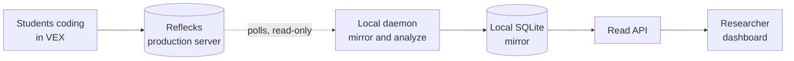
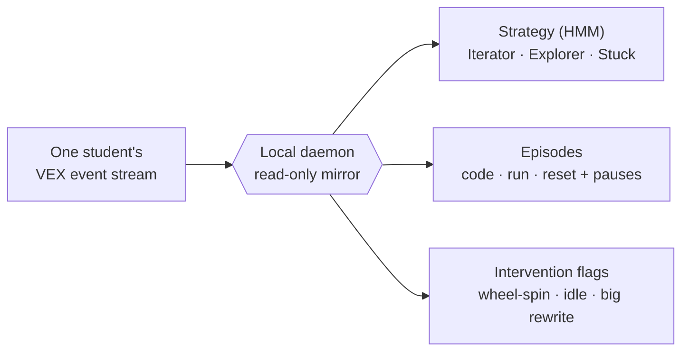

# LM Dashboard

LM Dashboard is a live "who needs help" board for a room full of students coding in
the VEX block environment. It mirrors what they're doing from the Reflecks
production backend onto your own machine, works out each student's coding
**strategy** with a Hidden Markov Model, splits their session into **episodes**,
raises **intervention flags** when someone is wheel-spinning, idle, or rewriting
everything, and lays it all out on one screen.

## How It Works, In One Paragraph

Students code in VEX, and their logs land in the Reflecks production server. A local
**daemon** asks that server's REST API for new events (keeping a cursor and backing
off when things go quiet), drops the raw logs into a local SQLite file, and keeps
each tracked student's derived state, strategy, episodes, and flags, up to date in a
**materialized table**. A small **read API** serves that table to a **React
dashboard**. Only the daemon writes; the dashboard recomputes nothing, it just reads
what's already there. And nothing ever flows back to production. It's a read-only
mirror, full stop.

## What You Get

For each student you track, the daemon takes a raw stream of VEX events and turns it
into three things you can actually act on:

The whole thing runs on one laptop with a single SQLite file, and production is never
touched.

## Where To Go Next

-   :material-rocket-launch:{ .lg .middle } **[Quickstart](quickstart.md)**

    ---

    Install it, add your credentials, and get all three processes running.

-   :material-sitemap:{ .lg .middle } **[Architecture](concepts/architecture.md)**

    ---

    The CQRS plus materialized-view design and the polled micro-batch model.

-   :material-monitor:{ .lg .middle } **[Using The Dashboard](guides/using-the-dashboard.md)**

    ---

    Student cards, the who-needs-help column, drill-down, and reset.

-   :material-code-tags:{ .lg .middle } **[API Reference](reference/api.md)**

    ---

    Every endpoint the read API exposes.

